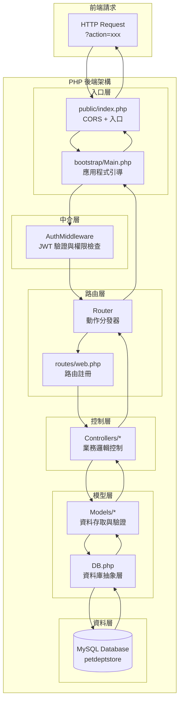

# Backend Implementation Details

本文件說明後端架構與實作方式，程式碼位於 `backend/` 目錄。

## Overview

後端採用 **PHP 8+** 搭配 **MySQL** 資料庫，實作自製 **MVC 架構**，整合 **JWT 認證**與**權限控管系統**。
透過 **Composer** 管理依賴套件，使用 **PDO** 進行資料庫操作，提供 **RESTful API** 服務。

## 核心技術棧

### 主要技術
- **PHP 8+** - 後端程式語言
- **MySQL/MariaDB** - 關聯式資料庫
- **PDO (PHP Data Objects)** - 資料庫存取層
- **Composer** - PHP 套件管理工具

### 第三方套件
- **firebase/php-jwt 6.3+** - JWT Token 處理
  - JWT 編碼與解碼
  - Token 簽名驗證
  - 過期時間管理

### 自製框架元件
- **自製 MVC 架構** - 模組化設計
- **Router 路由系統** - 動作分發機制
- **Middleware 中介層** - 認證與權限檢查
- **DB 資料庫抽象層** - 統一資料庫操作介面

## 功能簡述

- **JWT 認證系統** - 使用者登入驗證與 Token 管理
- **權限控管系統** - 基於角色的存取控制 (RBAC)
- **商品管理 API** - CRUD 操作與圖片上傳
- **訂單管理系統** - 完整的訂單生命週期管理
- **使用者管理** - 帳戶資料與角色管理
- **統計資料 API** - 訂單統計與分析功能

## Architecture



## Project Structure (detailed)

```
backend/
├── app/                        # 應用程式核心
│   ├── Controllers/            # 控制器層
│   │   ├── Account.php         # 使用者帳戶控制器
│   │   ├── Employee.php        # 員工管理控制器
│   │   ├── Order.php           # 訂單管理控制器
│   │   ├── Product.php         # 商品管理控制器
│   │   ├── Role.php            # 角色管理控制器
│   │   └── Supplier.php        # 供應商管理控制器
│   ├── Middlewares/            # 中介層
│   │   └── AuthMiddleware.php  # 認證與權限中介層
│   └── Models/                 # 模型層
│       ├── Account.php         # 使用者資料模型
│       ├── Action.php          # 動作權限模型
│       ├── Employee.php        # 員工資料模型
│       ├── Order.php           # 訂單資料模型
│       ├── Product.php         # 商品資料模型
│       ├── Role.php            # 角色資料模型
│       └── Supplier.php        # 供應商資料模型
├── bootstrap/                  # 應用程式引導
│   └── Main.php                # 主要引導程式
├── public/                     # 公開存取目錄
│   ├── index.php               # 應用程式入口點
│   └── uploads/                # 檔案上傳目錄
│       └── products/           # 商品圖片上傳
├── routes/                     # 路由定義
│   └── web.php                 # Web 路由註冊
├── sql/                        # 資料庫建置
│   └── petdeptstore (12).sql   # 資料庫結構與初始資料
├── vendor/                     # 自製與第三方套件
│   ├── firebase/               # JWT 套件
│   ├── composer/               # Composer 自動載入
│   ├── autoload.php            # PSR-4 自動載入設定
│   ├── Controller.php          # 控制器基底類別
│   ├── DB.php                  # 資料庫操作抽象層
│   └── Router.php              # 路由器實作
├── composer.json               # Composer 設定檔
└── composer.lock               # 套件版本鎖定
```

## Initialization Flow

### 1. 請求入口 (public/index.php)
```php
// 設定 CORS 標頭
header("Access-Control-Allow-Origin: http://localhost:3000");
header("Access-Control-Allow-Headers: Content-Type, Authorization, X-Requested-With, Auth");
header("Access-Control-Allow-Methods: GET, POST, PUT, DELETE, OPTIONS");

// 處理預檢請求
if ($_SERVER['REQUEST_METHOD'] == 'OPTIONS') {
    http_response_code(204);
    exit;
}

// 載入應用程式引導
require_once __DIR__ . '/../bootstrap/Main.php';
Main::run();
```

### 2. 應用程式引導 (bootstrap/Main.php)
1. **取得 Action 參數** - 從 `$_GET['action']` 取得要執行的動作
2. **載入環境設定** - 從 `.env` 檔案讀取資料庫連線設定
3. **初始化資料庫** - 設定 DB 類別的靜態屬性
4. **權限檢查分流**：
   - `getProducts` - 直接執行（無需認證）
   - `doLogin` - 執行登入流程
   - 其他動作 - 需通過 JWT 認證與權限檢查

### 3. 認證與權限檢查流程
```php
// 1. JWT Token 驗證
$response = AuthMiddleware::checkToken();

// 2. 權限檢查
if ($response['status'] == 200) {
    $response = AuthMiddleware::checkPermission($action);
    
    // 3. 執行路由
    if ($response['status'] == 200) {
        $router = new Router();
        require_once __DIR__ . "/../routes/web.php";
        $response = $router->run($action);
    }
}
```

## Authentication System

### JWT Token 管理

#### Token 生成
```php
private static function genToken($account_id){
    $secret_key = "1234";
    $payload = array(
        "iss" => "http://localhost",        // 發行者
        "aud" => "http://localhost",        // 接收者
        "iat" => time(),                    // 發行時間
        "exp" => time() + 3600,             // 過期時間 (1小時)
        "data" => array(
            "account_id" => $account_id
        )
    );
    return JWT::encode($payload, $secret_key, 'HS256');
}
```

#### Token 驗證
```php
public static function checkToken(){
    $headers = getallheaders();
    
    // 檢查 Auth Header
    if (!isset($headers['Auth']) || empty($headers['Auth'])) {
        return array('status' => 401, 'message' => "Missing authentication token");
    }
    
    $jwt = $headers['Auth'];
    $secret_key = "1234";
    
    try {
        $payload = JWT::decode($jwt, new Key($secret_key, 'HS256'));
        $account_id = $payload->data->account_id;
        
        // 取得用戶資料
        $sql = "SELECT account_id, account_code, role_id, email, full_name, addr, birth 
                FROM account WHERE account_id = ?";
        $userResult = DB::select($sql, [$account_id]);
        
        // 生成新 Token
        $newToken = self::genToken($account_id);
        
        return array(
            'status' => 200,
            'token' => $newToken,
            'user' => $userResult['result'][0]
        );
    } catch (Exception $e) {
        return array('status' => 403, 'message' => $e->getMessage());
    }
}
```

### 權限控管系統 (RBAC)

#### 權限檢查流程
1. **取得使用者角色** - 從 `user_role` 表取得使用者的角色清單
2. **取得動作權限** - 從 `role_action` 表取得該動作需要的角色
3. **權限比對** - 檢查使用者角色與動作權限是否有交集

```php
public static function checkPermission($action){
    // 1. 取得使用者角色
    $user_roles = $model->getRoles($id);
    
    // 2. 取得動作權限
    $actionModel = new Action();
    $action_roles = $actionModel->getRoles($action);
    
    // 3. 權限比對
    $intersection = array_intersect($user_roles, $action_roles);
    
    return count($intersection) > 0 
        ? array('status' => 200, 'message' => "權限通過")
        : array('status' => 403, 'message' => "權限不足");
}
```

## Router System

### 路由註冊 (routes/web.php)
```php
// 商品管理路由
$router->register(action: 'getProducts', class: 'Product', method: 'getProducts');
$router->register(action: 'newProduct', class: 'Product', method: 'newProduct');
$router->register(action: 'removeProduct', class: 'Product', method: 'removeProduct');
$router->register(action: 'updateProduct', class: 'Product', method: 'updateProduct');

// 訂單管理路由
$router->register(action: 'getOrders', class: 'Order', method: 'getOrders');
$router->register(action: 'newOrder', class: 'Order', method: 'newOrder');
$router->register(action: 'updateOrderStatus', class: 'Order', method: 'updateOrderStatus');

// 使用者管理路由
$router->register(action: 'getUsers', class: 'Account', method: 'getUsers');
$router->register(action: 'getUser', class: 'Account', method: 'getUser');
$router->register(action: 'updateUser', class: 'Account', method: 'updateUser');
```

### 路由器實作 (vendor/Router.php)
```php
class Router{
    private $routeTable = array();
    
    public function register($action, $class, $method){
        $this->routeTable[$action] = array(
            'class' => $class,
            'method' => $method
        );
    }
    
    public function run($action){
        if (!isset($this->routeTable[$action])) {
            return array('status' => 404, 'message' => "找不到對應的操作：$action");
        }
        
        $class = "Controllers\\" . $this->routeTable[$action]['class'];
        $method = $this->routeTable[$action]['method'];
        
        $controller = new $class();
        return $controller->$method();
    }
}
```

## Database Access Layer

### DB 抽象層 (vendor/DB.php)
```php
class DB extends Controller{
    public static $dbHost;
    public static $dbName; 
    public static $dbUser;
    public static $dbPassword;
    private static $conn = NULL;
    
    // 資料庫連線
    static function connect(){
        if(self::$conn != NULL) return;
        $dsn = sprintf("mysql:host=%s;dbname=%s;charset=utf8", self::$dbHost, self::$dbName);
        try {
            self::$conn = new PDO($dsn, self::$dbUser, self::$dbPassword);
        } catch (PDOException $e) {
            self::$conn = NULL;
        }
    }
    
    // SELECT 查詢
    static function select($sql, $args){
        self::connect();
        if (self::$conn == NULL) return self::response(14, "無法開啟DB");
        
        $stmt = self::$conn->prepare($sql);
        $result = $stmt->execute($args);
        
        if ($result) {
            $rows = $stmt->fetchAll(PDO::FETCH_ASSOC);
            return self::response(200, "查詢成功", $rows);
        } else {
            return self::response(400, "SQL錯誤");
        }
    }
    
    // INSERT 新增
    static function insert($sql, $args){
        self::connect();
        if (self::$conn == NULL) return self::response(14, "無法開啟DB");
        
        $stmt = self::$conn->prepare($sql);
        $result = $stmt->execute($args);
        
        if ($result) {
            $count = $stmt->rowCount();
            return ($count < 1) 
                ? self::response(204, "新增失敗") 
                : self::response(200, "新增成功");
        } else {
            return self::response(400, "SQL錯誤");
        }
    }
    
    // UPDATE 更新
    static function update($sql, $args) { /* 類似實作 */ }
    
    // DELETE 刪除  
    static function delete($sql, $args) { /* 類似實作 */ }
}
```

### 統一回應格式
所有 DB 操作皆回傳標準化格式：
```php
array(
    'status' => 200,           // HTTP 狀態碼
    'message' => "操作成功",    // 回應訊息
    'result' => $data          // 資料內容 (查詢時)
)
```

## Database Schema

### 核心資料表

#### 1. account (使用者帳戶)
```sql
CREATE TABLE `account` (
  `account_id` int(11) NOT NULL,
  `account_code` varchar(10) NOT NULL,
  `role_id` int(11) NOT NULL,
  `email` varchar(100) NOT NULL,
  `password` varchar(255) NOT NULL,
  `full_name` varchar(100) NOT NULL,
  `addr` varchar(255) DEFAULT NULL,
  `birth` date DEFAULT NULL
) ENGINE=InnoDB DEFAULT CHARSET=utf8mb4;
```

#### 2. product (商品資訊)
```sql
CREATE TABLE `product` (
  `product_id` int(11) NOT NULL,
  `name` varchar(100) NOT NULL,
  `price` decimal(10,2) NOT NULL,
  `stock` int(11) NOT NULL,
  `category` varchar(50) NOT NULL,
  `image_url` varchar(255) DEFAULT NULL
) ENGINE=InnoDB DEFAULT CHARSET=utf8mb4;
```

#### 3. orders (訂單主檔)
```sql
CREATE TABLE `orders` (
  `order_id` int(11) NOT NULL,
  `account_id` int(10) NOT NULL,
  `order_time` datetime NOT NULL,
  `status` varchar(20) NOT NULL DEFAULT 'pending'
) ENGINE=InnoDB DEFAULT CHARSET=utf8mb4;
```

#### 4. order_detail (訂單明細)
```sql
CREATE TABLE `order_detail` (
  `order_id` int(11) NOT NULL,
  `product_id` int(11) NOT NULL,
  `quantity` int(11) NOT NULL
) ENGINE=InnoDB DEFAULT CHARSET=utf8mb4;
```

### 權限管理資料表

#### 5. role (角色定義)
- 定義系統中的各種角色 (管理員、客戶等)

#### 6. action (動作定義)  
- 定義系統中的各種操作 (getProducts, newOrder 等)

#### 7. user_role (使用者角色關聯)
- 多對多關聯：一個使用者可有多個角色

#### 8. role_action (角色權限關聯)
- 多對多關聯：一個角色可執行多個動作

## API Routes Reference

### 商品管理 API
- **getProducts** - 取得商品列表
- **newProduct** - 新增商品（需權限）
- **updateProduct** - 更新商品（需權限）
- **removeProduct** - 刪除商品（需權限）

### 訂單管理 API
- **getOrders** - 取得訂單列表（需權限）
- **getOrder** - 取得特定使用者訂單
- **getOrderStatistics** - 取得訂單統計資料
- **newOrder** - 建立新訂單
- **updateOrderStatus** - 更新訂單狀態（需權限）
- **getOrderDetail** - 取得訂單詳細資料

### 使用者管理 API
- **doLogin** - 使用者登入（無需認證）
- **getUsers** - 取得使用者列表（需權限）
- **getUser** - 取得特定使用者資料
- **updateUser** - 更新使用者資料

## MVC Architecture Pattern

### Controllers (控制器層)
- **職責**：處理 HTTP 請求，協調 Model 與 View
- **範例**：`Controllers\Product`
```php
class Product extends Controller {
    private $pm;
    
    public function __construct() {
        $this->pm = new ProductModel();
    }
    
    public function getProducts(){
        if (isset($_POST['pid'])) {
            return $this->pm->getProduct($_POST['pid']);
        } else {
            return $this->pm->getProducts();
        }
    }
    
    public function newProduct(){
        $p_name = $_POST['p_name'];
        $price = $_POST['price'];
        $stock = $_POST['stock'];
        $category = $_POST['category'];
        
        // 處理圖片上傳
        $imageUrl = $this->handleImageUpload();
        
        return $this->pm->newProduct($p_name, $price, $stock, $category, $imageUrl);
    }
}
```

### Models (模型層)
- **職責**：資料存取、業務邏輯驗證、資料處理
- **範例**：`Models\Product`
```php
class Product {
    public function getProducts(){
        $sql = "SELECT * FROM `product`";
        return DB::select($sql, NULL);
    }
    
    public function newProduct($p_name, $price, $stock, $category, $imageUrl){
        // 業務邏輯驗證
        if(empty($p_name)) {
            return array('status' => 400, 'message' => "產品名稱不可為空");
        }
        
        if(!is_numeric($price) || $price <= 0) {
            return array('status' => 400, 'message' => "產品價格必須大於零");
        }
        
        // 檢查重複名稱
        $checkSql = "SELECT COUNT(*) AS count FROM `product` WHERE `name` = ?";
        $checkResult = DB::select($checkSql, array($p_name));
        
        if ($checkResult['result'][0]['count'] > 0) {
            return array('status' => 409, 'message' => "產品名稱已存在");
        }
        
        // 執行新增
        $sql = "INSERT INTO `product` (`name`, `price`, `stock`, `category`, `image_url`) 
                VALUES (?, ?, ?, ?, ?)";
        return DB::insert($sql, array($p_name, $price, $stock, $category, $imageUrl));
    }
}
```

## File Upload System

### 商品圖片上傳
```php
public function newProduct(){
    // ... 其他參數處理 ...
    
    $imageUrl = null;
    
    // 處理圖片上傳
    if (isset($_FILES['image']) && $_FILES['image']['error'] === UPLOAD_ERR_OK) {
        $uploadDir = __DIR__ . '/../../public/uploads/products/';
        $fileName = uniqid() . '-' . basename($_FILES['image']['name']);
        $uploadFile = $uploadDir . $fileName;
        
        if (move_uploaded_file($_FILES['image']['tmp_name'], $uploadFile)) {
            $imageUrl = 'uploads/products/' . $fileName;
        }
    }
    
    return $this->pm->newProduct($p_name, $price, $stock, $category, $imageUrl);
}
```

### 上傳目錄結構
```
public/uploads/
└── products/           # 商品圖片
    ├── 674a8b2c1d4e5-product1.jpg
    ├── 674a8b2c1d4e6-product2.png
    └── ...
```

## Error Handling & Response Format

### 標準回應格式
```php
// 成功回應
array(
    'status' => 200,
    'message' => '操作成功',
    'result' => $data,
    'token' => $newToken      // 認證後更新 token
)

// 錯誤回應
array(
    'status' => 400,          // 4xx 客戶端錯誤, 5xx 伺服器錯誤
    'message' => '錯誤訊息'
)
```

### 常見狀態碼
- **200** - 操作成功
- **204** - 無內容（操作失敗但無錯誤）
- **400** - 請求錯誤（參數錯誤、SQL 錯誤）
- **401** - 未認證（Token 無效或遺失）
- **403** - 權限不足
- **404** - 找不到對應的操作
- **409** - 衝突（如重複資料）
- **500** - 伺服器內部錯誤

## Security Features

### 1. SQL Injection 防護
- 使用 PDO Prepared Statements
- 所有動態參數皆透過參數化查詢

### 2. JWT Token 安全
- Token 過期機制（1小時）
- 每次請求更新 Token
- Secret Key 簽名驗證

### 3. CORS 設定
```php
header("Access-Control-Allow-Origin: http://localhost:3000");
header("Access-Control-Allow-Headers: Content-Type, Authorization, X-Requested-With, Auth");
header("Access-Control-Allow-Methods: GET, POST, PUT, DELETE, OPTIONS");
header("Access-Control-Allow-Credentials: true");
```

### 4. 檔案上傳安全
- 限制上傳目錄
- 檔名重新命名（使用 uniqid）
- 檔案類型驗證

## Performance Considerations

### 1. 資料庫最佳化
- 使用索引加速查詢
- 避免 N+1 查詢問題
- 適當的資料表正規化

### 2. 連線管理
- 單例模式的資料庫連線
- 連線重用機制

### 3. 快取策略
- 可考慮加入 Redis 快取常用資料
- Session 資料快取

## Development & Deployment

### 環境設定
```ini
# vendor/.env
dbHost=localhost
dbName=petdeptstore
dbUser=root
dbPassword=
```

### Composer 設定
```json
{
    "autoload": {
        "psr-4": {
            "Controllers\\": "app/Controllers/",
            "Models\\": "app/Models/",
            "Middlewares\\": "app/Middlewares/",
            "Vendor\\": "vendor/"
        }
    },
    "require": {
        "firebase/php-jwt": "^6.3"
    }
}
```

### 部署指令
```bash
# 安裝依賴
composer install

# 匯入資料庫
mysql -u root -p petdeptstore < sql/petdeptstore\ \(12\).sql

# 設定權限（uploads 目錄）
chmod 755 public/uploads/
chmod 755 public/uploads/products/
```

## 架構設計原則

### 1. 關注點分離
- **Controller**：處理 HTTP 請求與回應
- **Model**：封裝業務邏輯與資料存取
- **Middleware**：處理橫切關注點（認證、權限）

### 2. 單一職責原則
- 每個類別只負責一個特定功能
- 方法功能單純且可測試

### 3. 依賴注入
- Model 透過建構函式注入到 Controller
- 降低類別間的耦合度

### 4. 標準化回應
- 統一的 API 回應格式
- 一致的錯誤處理機制

### 5. 安全優先
- 所有使用者輸入皆進行驗證
- 實作適當的認證與權限控管
- 防範常見的安全漏洞

這個後端架構展現了現代 PHP 應用程式的完整設計，整合了認證、權限控管、資料驗證和安全機制，為前端提供了穩定可靠的 API 服務。

