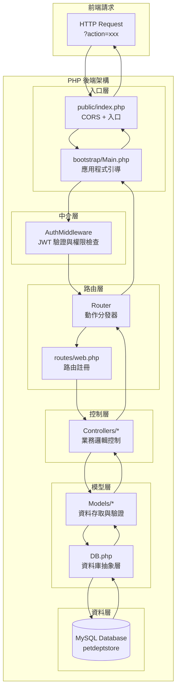

# Backend Implementation Details

本文件說明後端架構與實作方式，程式碼位於 `backend/` 目錄。

## Overview

後端採用 **PHP 8+** 搭配 **MySQL** 資料庫，實作自製 **MVC 架構**，整合 **JWT 認證**與**權限控管系統**。
透過 **Composer** 管理依賴套件，使用 **PDO** 進行資料庫操作，提供 **RESTful API** 服務。

## 核心技術棧

### 主要技術
- **PHP 8+** - 後端程式語言
- **MySQL/MariaDB** - 關聯式資料庫
- **PDO (PHP Data Objects)** - 資料庫存取層
- **Composer** - PHP 套件管理工具

### 第三方套件
- **firebase/php-jwt 6.3+** - JWT Token 處理
  - JWT 編碼與解碼
  - Token 簽名驗證
  - 過期時間管理

### 自製框架元件
- **自製 MVC 架構** - 模組化設計
- **Router 路由系統** - 動作分發機制
- **Middleware 中介層** - 認證與權限檢查
- **DB 資料庫抽象層** - 統一資料庫操作介面

## 功能簡述

- **JWT 認證系統** - 使用者登入驗證與 Token 管理
- **權限控管系統** - 基於角色的存取控制 (RBAC)
- **商品管理 API** - CRUD 操作與圖片上傳
- **訂單管理系統** - 完整的訂單生命週期管理
- **使用者管理** - 帳戶資料與角色管理
- **購物車系統** - 完整的購物車管理功能
- **註冊系統** - 用戶自主註冊與資料驗證
- **統計資料 API** - 訂單統計與分析功能

## Architecture



## Project Structure (detailed)

```
backend/
├── app/                        # 應用程式核心
│   ├── Controllers/            # 控制器層
│   │   ├── Account.php         # 使用者帳戶控制器
│   │   ├── Employee.php        # 員工管理控制器
│   │   ├── Order.php           # 訂單管理控制器
│   │   ├── Product.php         # 商品管理控制器
│   │   ├── Role.php            # 角色管理控制器
│   │   └── Supplier.php        # 供應商管理控制器
│   ├── Middlewares/            # 中介層
│   │   └── AuthMiddleware.php  # 認證與權限中介層
│   └── Models/                 # 模型層
│       ├── Account.php         # 使用者資料模型
│       ├── Action.php          # 動作權限模型
│       ├── Employee.php        # 員工資料模型
│       ├── Order.php           # 訂單資料模型
│       ├── Product.php         # 商品資料模型
│       ├── Role.php            # 角色資料模型
│       └── Supplier.php        # 供應商資料模型
├── bootstrap/                  # 應用程式引導
│   └── Main.php                # 主要引導程式
├── public/                     # 公開存取目錄
│   ├── index.php               # 應用程式入口點
│   └── uploads/                # 檔案上傳目錄
│       └── products/           # 商品圖片上傳
├── routes/                     # 路由定義
│   └── web.php                 # Web 路由註冊
├── sql/                        # 資料庫建置
│   └── petdeptstore (12).sql   # 資料庫結構與初始資料
├── vendor/                     # 自製與第三方套件
│   ├── firebase/               # JWT 套件
│   ├── composer/               # Composer 自動載入
│   ├── autoload.php            # PSR-4 自動載入設定
│   ├── Controller.php          # 控制器基底類別
│   ├── DB.php                  # 資料庫操作抽象層
│   └── Router.php              # 路由器實作
├── composer.json               # Composer 設定檔
└── composer.lock               # 套件版本鎖定
```

## Initialization Flow

### 1. 請求入口 (public/index.php)
```php
// 設定 CORS 標頭
header("Access-Control-Allow-Origin: http://localhost:3000");
header("Access-Control-Allow-Headers: Content-Type, Authorization, X-Requested-With, Auth");
header("Access-Control-Allow-Methods: GET, POST, PUT, DELETE, OPTIONS");

// 處理預檢請求
if ($_SERVER['REQUEST_METHOD'] == 'OPTIONS') {
    http_response_code(204);
    exit;
}

// 載入應用程式引導
require_once __DIR__ . '/../bootstrap/Main.php';
Main::run();
```

### 2. 應用程式引導 (bootstrap/Main.php)
1. **取得 Action 參數** - 從 `$_GET['action']` 取得要執行的動作
2. **載入環境設定** - 從 `.env` 檔案讀取資料庫連線設定
3. **初始化資料庫** - 設定 DB 類別的靜態屬性
4. **權限檢查分流**：
   - `getProducts` - 直接執行（無需認證）
   - `doLogin` - 執行登入流程
   - 其他動作 - 需通過 JWT 認證與權限檢查

### 3. 認證與權限檢查流程
```php
// 1. JWT Token 驗證
$response = AuthMiddleware::checkToken();

// 2. 權限檢查
if ($response['status'] == 200) {
    $response = AuthMiddleware::checkPermission($action);
    
    // 3. 執行路由
    if ($response['status'] == 200) {
        $router = new Router();
        require_once __DIR__ . "/../routes/web.php";
        $response = $router->run($action);
    }
}
```

## Authentication System

### JWT Token 管理

#### Token 生成
```php
private static function genToken($account_id){
    $secret_key = "1234";
    $payload = array(
        "iss" => "http://localhost",        // 發行者
        "aud" => "http://localhost",        // 接收者
        "iat" => time(),                    // 發行時間
        "exp" => time() + 3600,             // 過期時間 (1小時)
        "data" => array(
            "account_id" => $account_id
        )
    );
    return JWT::encode($payload, $secret_key, 'HS256');
}
```

#### Token 驗證
```php
public static function checkToken(){
    $headers = getallheaders();
    
    // 檢查 Auth Header
    if (!isset($headers['Auth']) || empty($headers['Auth'])) {
        return array('status' => 401, 'message' => "Missing authentication token");
    }
    
    $jwt = $headers['Auth'];
    $secret_key = "1234";
    
    try {
        $payload = JWT::decode($jwt, new Key($secret_key, 'HS256'));
        $account_id = $payload->data->account_id;
        
        // 取得用戶資料
        $sql = "SELECT account_id, account_code, role_id, email, full_name, addr, birth 
                FROM account WHERE account_id = ?";
        $userResult = DB::select($sql, [$account_id]);
        
        // 生成新 Token
        $newToken = self::genToken($account_id);
        
        return array(
            'status' => 200,
            'token' => $newToken,
            'user' => $userResult['result'][0]
        );
    } catch (Exception $e) {
        return array('status' => 403, 'message' => $e->getMessage());
    }
}
```

### 權限控管系統 (RBAC)

#### 權限檢查流程
1. **取得使用者角色** - 從 `user_role` 表取得使用者的角色清單
2. **取得動作權限** - 從 `role_action` 表取得該動作需要的角色
3. **權限比對** - 檢查使用者角色與動作權限是否有交集

```php
public static function checkPermission($action){
    // 1. 取得使用者角色
    $user_roles = $model->getRoles($id);
    
    // 2. 取得動作權限
    $actionModel = new Action();
    $action_roles = $actionModel->getRoles($action);
    
    // 3. 權限比對
    $intersection = array_intersect($user_roles, $action_roles);
    
    return count($intersection) > 0 
        ? array('status' => 200, 'message' => "權限通過")
        : array('status' => 403, 'message' => "權限不足");
}
```

## Router System

### 路由註冊 (routes/web.php)
```php
// 商品管理路由
$router->register(action: 'getProducts', class: 'Product', method: 'getProducts');
$router->register(action: 'newProduct', class: 'Product', method: 'newProduct');
$router->register(action: 'removeProduct', class: 'Product', method: 'removeProduct');
$router->register(action: 'updateProduct', class: 'Product', method: 'updateProduct');

// 訂單管理路由
$router->register(action: 'getOrders', class: 'Order', method: 'getOrders');
$router->register(action: 'newOrder', class: 'Order', method: 'newOrder');
$router->register(action: 'updateOrderStatus', class: 'Order', method: 'updateOrderStatus');

// 使用者管理路由
$router->register(action: 'getUsers', class: 'Account', method: 'getUsers');
$router->register(action: 'getUser', class: 'Account', method: 'getUser');
$router->register(action: 'updateUser', class: 'Account', method: 'updateUser');
```

### 路由器實作 (vendor/Router.php)
```php
class Router{
    private $routeTable = array();
    
    public function register($action, $class, $method){
        $this->routeTable[$action] = array(
            'class' => $class,
            'method' => $method
        );
    }
    
    public function run($action){
        if (!isset($this->routeTable[$action])) {
            return array('status' => 404, 'message' => "找不到對應的操作：$action");
        }
        
        $class = "Controllers\\" . $this->routeTable[$action]['class'];
        $method = $this->routeTable[$action]['method'];
        
        $controller = new $class();
        return $controller->$method();
    }
}
```

## Database Access Layer

### DB 抽象層 (vendor/DB.php)
```php
class DB extends Controller{
    public static $dbHost;
    public static $dbName; 
    public static $dbUser;
    public static $dbPassword;
    private static $conn = NULL;
    
    // 資料庫連線
    static function connect(){
        if(self::$conn != NULL) return;
        $dsn = sprintf("mysql:host=%s;dbname=%s;charset=utf8", self::$dbHost, self::$dbName);
        try {
            self::$conn = new PDO($dsn, self::$dbUser, self::$dbPassword);
        } catch (PDOException $e) {
            self::$conn = NULL;
        }
    }
    
    // SELECT 查詢
    static function select($sql, $args){
        self::connect();
        if (self::$conn == NULL) return self::response(14, "無法開啟DB");
        
        $stmt = self::$conn->prepare($sql);
        $result = $stmt->execute($args);
        
        if ($result) {
            $rows = $stmt->fetchAll(PDO::FETCH_ASSOC);
            return self::response(200, "查詢成功", $rows);
        } else {
            return self::response(400, "SQL錯誤");
        }
    }
    
    // INSERT 新增
    static function insert($sql, $args){
        self::connect();
        if (self::$conn == NULL) return self::response(14, "無法開啟DB");
        
        $stmt = self::$conn->prepare($sql);
        $result = $stmt->execute($args);
        
        if ($result) {
            $count = $stmt->rowCount();
            return ($count < 1) 
                ? self::response(204, "新增失敗") 
                : self::response(200, "新增成功");
        } else {
            return self::response(400, "SQL錯誤");
        }
    }
    
    // UPDATE 更新
    static function update($sql, $args) { /* 類似實作 */ }
    
    // DELETE 刪除  
    static function delete($sql, $args) { /* 類似實作 */ }
}
```

### 統一回應格式
所有 DB 操作皆回傳標準化格式：
```php
array(
    'status' => 200,           // HTTP 狀態碼
    'message' => "操作成功",    // 回應訊息
    'result' => $data          // 資料內容 (查詢時)
)
```

## Database Schema

### 核心資料表

#### 1. account (使用者帳戶)
```sql
CREATE TABLE `account` (
  `account_id` int(11) NOT NULL,
  `account_code` varchar(10) NOT NULL,
  `role_id` int(11) NOT NULL,
  `email` varchar(100) NOT NULL,
  `password` varchar(255) NOT NULL,
  `full_name` varchar(100) NOT NULL,
  `addr` varchar(255) DEFAULT NULL,
  `birth` date DEFAULT NULL
) ENGINE=InnoDB DEFAULT CHARSET=utf8mb4;
```

#### 2. product (商品資訊)
```sql
CREATE TABLE `product` (
  `product_id` int(11) NOT NULL,
  `name` varchar(100) NOT NULL,
  `price` decimal(10,2) NOT NULL,
  `stock` int(11) NOT NULL,
  `category` varchar(50) NOT NULL,
  `image_url` varchar(255) DEFAULT NULL
) ENGINE=InnoDB DEFAULT CHARSET=utf8mb4;
```

#### 3. orders (訂單主檔)
```sql
CREATE TABLE `orders` (
  `order_id` int(11) NOT NULL,
  `account_id` int(10) NOT NULL,
  `order_time` datetime NOT NULL,
  `status` varchar(20) NOT NULL DEFAULT 'pending'
) ENGINE=InnoDB DEFAULT CHARSET=utf8mb4;
```

#### 4. order_detail (訂單明細)
```sql
CREATE TABLE `order_detail` (
  `order_id` int(11) NOT NULL,
  `product_id` int(11) NOT NULL,
  `quantity` int(11) NOT NULL
) ENGINE=InnoDB DEFAULT CHARSET=utf8mb4;
```

### 權限管理資料表

#### 5. role (角色定義)
- 定義系統中的各種角色 (管理員、客戶等)

#### 6. action (動作定義)  
- 定義系統中的各種操作 (getProducts, newOrder 等)

#### 7. user_role (使用者角色關聯)
- 多對多關聯：一個使用者可有多個角色

#### 8. role_action (角色權限關聯)
- 多對多關聯：一個角色可執行多個動作

## API Routes Reference

### 使用者認證 API
- **doLogin** - 使用者登入（無需認證）
- **newUser** - 使用者註冊（無需認證）

### 商品管理 API
- **getProducts** - 取得商品列表（無需認證）
- **newProduct** - 新增商品（需權限）
- **updateProduct** - 更新商品（需權限）
- **removeProduct** - 刪除商品（需權限）

### 訂單管理 API
- **getOrders** - 取得訂單列表（需權限）
- **getOrder** - 取得特定使用者訂單
- **getOrderStatistics** - 取得訂單統計資料
- **newOrder** - 建立新訂單
- **updateOrderStatus** - 更新訂單狀態（需權限）
- **getOrderDetail** - 取得訂單詳細資料
- **removeOrder** - 取消訂單

### 使用者管理 API
- **getUsers** - 取得使用者列表（需權限）
- **getUser** - 取得特定使用者資料
- **updateUser** - 更新使用者資料

### 購物車管理 API
- **getCart** - 取得購物車內容
- **addToCart** - 加入商品到購物車
- **updateCartItem** - 更新購物車商品數量
- **removeFromCart** - 移除購物車商品
- **clearCart** - 清空購物車
- **getCartStatistics** - 取得購物車統計資訊

## 完整 API 業務邏輯與處理流程

### 使用者認證 API

#### `doLogin` - 使用者登入
**控制器**: `Controllers\Account::doLogin()`  
**模型**: `Models\Account::doLogin()`  
**權限**: 無需認證

**業務流程**:
1. **參數驗證**: 檢查 `account_code` 和 `password` 是否提供
2. **帳戶查詢**: 在 `account` 表中查詢匹配的帳戶
3. **密碼驗證**: 比對輸入密碼與資料庫密碼（目前為明文比對）
4. **JWT 生成**: 為通過驗證的用戶生成 JWT Token
5. **回應數據**: 返回用戶資訊和 Token

**回應格式**:
```php
// 成功
array(
    'status' => 200,
    'message' => '登入成功',
    'token' => $jwt_token,
    'user' => $user_data
)

// 失敗
array(
    'status' => 401,
    'message' => '帳號或密碼錯誤'
)
```

#### `newUser` - 使用者註冊
**控制器**: `Controllers\Account::newUser()`  
**模型**: `Models\Account::newAccount()`  
**權限**: 無需認證（公開 API）

**業務流程**:
1. **參數驗證**:
   - 必填欄位檢查: `account_code`, `email`, `password`, `name`
   - 帳號格式驗證: 3-10字元，僅英文數字
   - Email 格式驗證: `filter_var()` 檢查
   - 密碼強度檢查: 至少6個字元

2. **唯一性檢查**:
   - 檢查帳號是否已存在
   - 檢查 Email 是否已被註冊

3. **帳戶建立**:
   - 在 `account` 表新增用戶記錄
   - 預設角色為客戶 (`role_id = 2`)

4. **角色關聯**:
   - 在 `user_role` 表建立用戶-角色關聯

5. **購物車初始化**:
   - 在 `shopping_cart` 表為新用戶建立購物車

6. **完整性驗證**:
   - 檢查所有關聯資料是否正確建立

7. **錯誤回滾**:
   - 如有任何步驟失敗，清理已建立的資料

**特殊處理**:
- **事務控制**: 雖未使用資料庫事務，但實現了手動回滾機制
- **清理機制**: 失敗時會逐步清理 `shopping_cart`, `user_role`, `account` 記錄
- **資料一致性**: 通過驗證確保所有必要記錄都已正確建立

**回應格式**:
```php
// 成功
array(
    'status' => 200,
    'message' => '註冊成功',
    'account_code' => $account_code,
    'full_name' => $full_name
)

// 失敗範例
array(
    'status' => 409,
    'message' => '此帳號已被註冊'
)
```

### 商品管理 API

#### `getProducts` - 取得商品列表
**控制器**: `Controllers\Product::getProducts()`  
**模型**: `Models\Product::getProducts()` / `getProduct()`  
**權限**: 無需認證（公開 API）

**業務流程**:
1. **參數檢查**: 若有 `pid` 參數則查詢單一商品，否則查詢全部
2. **資料查詢**: 從 `product` 表查詢商品資訊
3. **圖片URL處理**: 自動組合完整的圖片URL路徑

#### `newProduct` - 新增商品
**控制器**: `Controllers\Product::newProduct()`  
**模型**: `Models\Product::newProduct()`  
**權限**: 需要管理員權限

**業務流程**:
1. **參數驗證**:
   - 商品名稱不可為空
   - 價格必須為正數
   - 庫存不可為負數

2. **唯一性檢查**: 確保商品名稱不重複

3. **圖片上傳處理**:
   - 檢查上傳檔案是否有效
   - 使用 `uniqid()` 生成唯一檔名
   - 移動檔案到 `public/uploads/products/` 目錄

4. **資料庫操作**: 在 `product` 表新增商品記錄

#### `updateProduct` - 更新商品
**控制器**: `Controllers\Product::updateProduct()`  
**模型**: `Models\Product::updateProduct()`  
**權限**: 需要管理員權限

**業務流程**:
1. **參數驗證**: 與新增商品相同的驗證規則
2. **商品存在性檢查**: 確認商品ID存在
3. **圖片處理**: 如有新圖片則處理上傳，否則保留原圖
4. **更新操作**: 更新 `product` 表記錄

#### `removeProduct` - 刪除商品
**控制器**: `Controllers\Product::removeProduct()`  
**模型**: `Models\Product::removeProduct()`  
**權限**: 需要管理員權限

**業務流程**:
1. **參數檢查**: 驗證產品ID
2. **相依性檢查**: 檢查是否有訂單使用此商品（目前未實作）
3. **刪除操作**: 從 `product` 表刪除記錄

### 訂單管理 API

#### `getOrders` - 取得訂單列表
**控制器**: `Controllers\Order::getOrders()`  
**模型**: `Models\Order::getOrders()` / `getOrder()`  
**權限**: 管理員可查看全部，客戶僅能查看自己的

**業務流程**:
1. **權限判斷**: 根據是否有 `account_id` 參數決定查詢範圍
2. **管理員檢視**: 顯示所有訂單的總覽，包含客戶資訊和訂單金額
3. **客戶檢視**: 僅顯示該客戶的訂單，隱藏其他客戶資訊
4. **聚合計算**: 自動計算訂單總金額和商品種類數量

#### `newOrder` - 建立新訂單
**控制器**: `Controllers\Order::newOrder()`  
**模型**: `Models\Order::newOrder()`  
**權限**: 需要登入

**業務流程**:
1. **參數驗證**:
   - 帳戶ID有效性
   - 商品ID陣列格式
   - 數量陣列格式

2. **庫存檢查**:
   - 逐一檢查每項商品的庫存
   - 確保庫存足夠滿足訂單需求

3. **訂單建立**:
   - 在 `orders` 表新增訂單主記錄
   - 狀態設為 'pending'

4. **訂單明細**:
   - 在 `order_detail` 表新增每項商品記錄
   - 記錄商品ID和數量

5. **庫存更新**:
   - 從 `product` 表扣除對應庫存
   - 使用原子操作確保資料一致性

6. **購物車清理**:
   - 訂單成功後清空對應的購物車

**錯誤處理**:
- 庫存不足時提供詳細的錯誤訊息
- 任何步驟失敗都會回滾已執行的操作

#### `updateOrderStatus` - 更新訂單狀態
**控制器**: `Controllers\Order::updateOrderStatus()`  
**模型**: `Models\Order::updateOrderStatus()`  
**權限**: 需要管理員權限

**業務流程**:
1. **參數驗證**: 檢查訂單ID和狀態值
2. **狀態驗證**: 確保狀態值在允許範圍內
3. **訂單存在性**: 確認訂單存在
4. **狀態更新**: 更新 `orders` 表的狀態欄位

**支援狀態**:
- `pending` - 待處理
- `processing` - 處理中
- `shipped` - 已出貨
- `cancelled` - 已取消

#### `removeOrder` - 取消訂單
**控制器**: `Controllers\Order::removeOrder()`  
**模型**: `Models\Order::removeOrder()`  
**權限**: 客戶僅能取消自己的訂單

**業務流程**:
1. **權限驗證**: 確認客戶只能取消自己的訂單
2. **狀態檢查**: 僅允許取消 'pending' 狀態的訂單
3. **庫存回滾**: 將訂單商品的數量歸還到庫存
4. **狀態更新**: 將訂單狀態改為 'cancelled'

**特殊邏輯**:
- 管理員可以取消任何訂單
- 客戶僅能取消自己的訂單
- 已出貨的訂單無法取消

### 購物車管理 API

#### `getCart` - 取得購物車內容
**控制器**: `Controllers\Cart::getCart()`  
**模型**: `Models\Cart::getUserCart()`  
**權限**: 需要登入

**業務流程**:
1. **購物車檢查**: 確認用戶是否有活躍的購物車
2. **自動建立**: 如無購物車則自動建立
3. **商品查詢**: 查詢購物車中的所有商品
4. **價格計算**: 計算各項目小計和總計
5. **庫存檢查**: 檢查商品庫存狀態
6. **價格驗證**: 比對購物車價格與當前商品價格

**回應包含**:
- 購物車商品列表
- 各商品的數量和小計
- 購物車總計資訊
- 庫存狀態警告

#### `addToCart` - 加入商品到購物車
**控制器**: `Controllers\Cart::addToCart()`  
**模型**: `Models\Cart::addToCart()`  
**權限**: 需要登入

**業務流程**:
1. **參數驗證**: 檢查帳戶ID、商品ID、數量
2. **商品驗證**: 確認商品存在且庫存充足
3. **購物車準備**: 獲取或建立用戶的活躍購物車
4. **重複檢查**: 檢查商品是否已在購物車中
5. **數量處理**:
   - 如商品已存在，累加數量
   - 如為新商品，新增記錄
6. **庫存限制**: 確保總數量不超過庫存
7. **價格記錄**: 記錄加入時的商品價格

#### `updateCartItem` - 更新購物車商品數量
**控制器**: `Controllers\Cart::updateCartItem()`  
**模型**: `Models\Cart::updateCartItem()`  
**權限**: 需要登入

**業務流程**:
1. **參數驗證**: 檢查購物車項目ID和新數量
2. **所有權驗證**: 確認該購物車項目屬於當前用戶
3. **庫存檢查**: 確認新數量不超過商品庫存
4. **特殊處理**: 數量為0時自動刪除該項目
5. **更新操作**: 更新 `cart_items` 表記錄
6. **統計更新**: 觸發購物車更新時間戳

#### `removeFromCart` - 移除購物車商品
**控制器**: `Controllers\Cart::removeFromCart()`  
**模型**: `Models\Cart::removeFromCart()`  
**權限**: 需要登入

**業務流程**:
1. **參數驗證**: 檢查購物車項目ID
2. **所有權驗證**: 確認該項目屬於當前用戶
3. **刪除操作**: 從 `cart_items` 表刪除記錄
4. **觸發器**: 資料庫觸發器自動更新購物車時間戳

#### `clearCart` - 清空購物車
**控制器**: `Controllers\Cart::clearCart()`  
**模型**: `Models\Cart::clearCart()`  
**權限**: 需要登入

**業務流程**:
1. **購物車定位**: 找到用戶的活躍購物車
2. **批量刪除**: 刪除該購物車的所有商品項目
3. **狀態更新**: 保持購物車狀態為活躍但內容為空

### 使用者管理 API

#### `getUsers` - 取得使用者列表
**控制器**: `Controllers\Account::getUsers()`  
**模型**: `Models\Account::getAccounts()`  
**權限**: 需要管理員權限

**業務流程**:
1. **參數檢查**: 若有 `uid` 參數則查詢單一用戶
2. **資料查詢**: 從 `account` 表查詢用戶資訊
3. **敏感資料過濾**: 不返回密碼等敏感資訊

#### `updateUser` - 更新使用者資料
**控制器**: `Controllers\Account::updateUser()`  
**模型**: `Models\Account::updateAccount()`  
**權限**: 需要登入（可更新自己的資料）

**業務流程**:
1. **參數驗證**: 檢查必要欄位
2. **權限檢查**: 確認只能更新自己的資料（或管理員）
3. **密碼處理**: 如提供新密碼則更新，否則保持原密碼
4. **資料更新**: 更新 `account` 表記錄

### 統計 API

#### `getOrderStatistics` - 取得訂單統計
**控制器**: `Controllers\Order::getOrderStatistics()`  
**模型**: `Models\Order::getOrderStatistics()`  
**權限**: 需要登入

**業務流程**:
1. **總訂單數**: 計算用戶的所有訂單數量
2. **取消訂單數**: 計算已取消的訂單數量
3. **實際購買金額**: 計算排除取消訂單的總金額
4. **商品種類數**: 計算購買過的商品種類總數

**統計指標**:
- `total_orders`: 總訂單數
- `cancelled_orders`: 已取消訂單數
- `total_amount`: 實際購買金額
- `total_items`: 購買商品種類數

#### `getCartStatistics` - 取得購物車統計
**控制器**: `Controllers\Cart::getCartStatistics()`  
**模型**: `Models\Cart::getCartStatistics()`  
**權限**: 需要登入

**業務流程**:
1. **購物車定位**: 找到用戶的活躍購物車
2. **商品統計**: 計算購物車中的商品數量
3. **金額計算**: 計算購物車總金額
4. **項目統計**: 計算不同商品的種類數

**統計指標**:
- `total_items`: 購物車商品種類數
- `total_quantity`: 購物車商品總數量
- `total_amount`: 購物車總金額

## 資料庫觸發器與約束

### 購物車相關觸發器
```sql
-- 新增/更新/刪除購物車項目時自動更新購物車時間戳
CREATE TRIGGER tr_cart_items_insert_cart AFTER INSERT ON cart_items
CREATE TRIGGER tr_cart_items_update_cart AFTER UPDATE ON cart_items  
CREATE TRIGGER tr_cart_items_delete_cart AFTER DELETE ON cart_items
```

### 外鍵約束
- `cart_items.cart_id` → `shopping_cart.cart_id` (CASCADE)
- `cart_items.product_id` → `product.product_id` (CASCADE)
- `orders.account_id` → `account.account_id` (CASCADE)
- `order_detail.order_id` → `orders.order_id` (CASCADE)
- `user_role.account_id` → `account.account_id` (CASCADE)

## 錯誤處理機制

### 分層錯誤處理
1. **控制器層**: 參數驗證、格式檢查
2. **模型層**: 業務邏輯驗證、資料一致性檢查
3. **資料庫層**: SQL 錯誤、約束違反

### 標準錯誤格式
```php
array(
    'status' => $http_status_code,
    'message' => $error_message
)
```

### 常見錯誤狀態碼
- **400**: 參數錯誤、格式不正確
- **401**: 未認證、Token 無效
- **403**: 權限不足
- **404**: 資源不存在
- **409**: 資料衝突（如重複註冊）
- **500**: 伺服器內部錯誤

## 註冊系統深度解析 (Registration System Deep Dive)

### 註冊流程設計原則

#### 1. 安全優先原則
- **多層驗證**: 前端驗證 + 後端驗證的雙重保護
- **資料完整性**: 確保帳戶、角色、購物車資料的一致性
- **回滾機制**: 任何步驟失敗都會清理已建立的資料

#### 2. 用戶體驗原則
- **即時反饋**: 提供具體的成功/失敗訊息
- **零障礙**: 註冊完成即可立即使用所有功能
- **容錯性**: 網路中斷或部分失敗時的優雅處理

### 註冊API實現細節

#### 控制器層 (`Controllers\Account::newUser()`)
```php
public function newUser(){
    // 1. 必要參數檢查
    if (!isset($_POST['account_code']) || empty($_POST['account_code'])) {
        return array('status' => 400, 'message' => '帳號為必填欄位');
    }
    
    // 2. 帳號格式驗證
    if (strlen($_POST['account_code']) < 3 || strlen($_POST['account_code']) > 10) {
        return array('status' => 400, 'message' => '帳號長度必須在3-10個字元之間');
    }
    
    if (!preg_match('/^[a-zA-Z0-9]+$/', $_POST['account_code'])) {
        return array('status' => 400, 'message' => '帳號只能包含英文字母和數字');
    }
    
    // 3. Email 格式驗證
    if (!filter_var($_POST['email'], FILTER_VALIDATE_EMAIL)) {
        return array('status' => 400, 'message' => 'Email 格式不正確');
    }
    
    // 4. 密碼強度檢查
    if (strlen($_POST['password']) < 6) {
        return array('status' => 400, 'message' => '密碼長度至少需要6個字元');
    }
    
    // 5. 呼叫模型層處理業務邏輯
    return $this->am->newAccount(
        $_POST['account_code'],
        $_POST['email'], 
        $_POST['password'],
        $_POST['name'],
        $_POST['addr'] ?? null,
        $_POST['bir'] ?? null
    );
}
```

#### 模型層複合事務處理
```php
public function newAccount($account_code, $email, $password, $fullName, $addr = null, $birth = null, $roleId = 2) {
    try {
        // 第一階段：唯一性檢查
        $accountExists = DB::select("SELECT account_id FROM account WHERE account_code=?", [$account_code]);
        if (!empty($accountExists['result'])) {
            return array('status' => 409, 'message' => "此帳號已被註冊");
        }
        
        $emailExists = DB::select("SELECT account_id FROM account WHERE email=?", [$email]);
        if (!empty($emailExists['result'])) {
            return array('status' => 409, 'message' => "此電子郵件已被註冊");
        }
        
        // 第二階段：建立帳戶
        $insertResult = DB::insert(
            "INSERT INTO account (account_code, email, password, full_name, addr, birth, role_id) VALUES (?, ?, ?, ?, ?, ?, ?)",
            [$account_code, $email, $password, $fullName, $addr, $birth, $roleId]
        );
        
        if ($insertResult['status'] !== 200) {
            return array('status' => 500, 'message' => "用戶註冊失敗");
        }
        
        // 第三階段：獲取新帳戶ID
        $newAccountId = $this->getNewAccountId($email);
        
        // 第四階段：建立角色關聯
        $roleResult = DB::insert(
            "INSERT INTO user_role (account_id, role_id) VALUES (?, ?)",
            [$newAccountId, $roleId]
        );
        
        // 第五階段：建立購物車
        $cartResult = DB::insert(
            "INSERT INTO shopping_cart (account_id, status) VALUES (?, 'active')",
            [$newAccountId]
        );
        
        // 第六階段：完整性驗證
        $validation = $this->validateRegistrationIntegrity($newAccountId, $roleId);
        
        if (!$validation['valid']) {
            // 觸發清理程序
            $this->cleanupFailedRegistration($newAccountId, $roleId);
            return array('status' => 500, 'message' => '註冊驗證失敗: ' . $validation['reason']);
        }
        
        return array(
            'status' => 200,
            'message' => '註冊成功',
            'account_code' => $account_code,
            'full_name' => $fullName
        );
        
    } catch (Exception $e) {
        // 異常處理與清理
        error_log("註冊過程異常: " . $e->getMessage());
        if (isset($newAccountId)) {
            $this->cleanupFailedRegistration($newAccountId, $roleId);
        }
        return array('status' => 500, 'message' => '註冊過程發生錯誤，請稍後再試');
    }
}
```

#### 資料完整性驗證機制
```php
private function validateRegistrationIntegrity($accountId, $roleId) {
    // 檢查帳戶是否存在
    $accountCheck = DB::select("SELECT account_id FROM account WHERE account_id = ?", [$accountId]);
    if (empty($accountCheck['result'])) {
        return array('valid' => false, 'reason' => '帳戶不存在');
    }
    
    // 檢查角色關聯是否存在
    $roleCheck = DB::select("SELECT id FROM user_role WHERE account_id = ? AND role_id = ?", [$accountId, $roleId]);
    if (empty($roleCheck['result'])) {
        return array('valid' => false, 'reason' => '角色關聯不存在');
    }
    
    // 檢查購物車是否建立
    $cartCheck = DB::select("SELECT cart_id FROM shopping_cart WHERE account_id = ? AND status = 'active'", [$accountId]);
    if (empty($cartCheck['result'])) {
        return array('valid' => false, 'reason' => '購物車建立失敗');
    }
    
    return array('valid' => true, 'reason' => '驗證通過');
}
```

#### 失敗清理機制
```php
private function cleanupFailedRegistration($accountId, $roleId) {
    try {
        // 步驟1：清理購物車記錄
        $cartCleanup = DB::delete("DELETE FROM shopping_cart WHERE account_id = ?", [$accountId]);
        error_log("購物車清理結果: " . json_encode($cartCleanup));
        
        // 步驟2：清理角色關聯
        $roleCleanup = DB::delete("DELETE FROM user_role WHERE account_id = ? AND role_id = ?", [$accountId, $roleId]);
        error_log("角色關聯清理結果: " . json_encode($roleCleanup));
        
        // 步驟3：清理帳戶記錄
        $accountCleanup = DB::delete("DELETE FROM account WHERE account_id = ?", [$accountId]);
        error_log("帳戶清理結果: " . json_encode($accountCleanup));
        
        return true;
    } catch (Exception $e) {
        error_log("清理失敗註冊資料時發生錯誤: " . $e->getMessage());
        error_log("需要手動清理的帳戶ID: " . $accountId);
        return false;
    }
}
```

### 安全性設計考量

#### 1. 輸入驗證安全
- **SQL Injection 防護**: 所有資料庫操作使用 PDO 預處理語句
- **XSS 防護**: 後端不信任任何前端資料，重新驗證所有輸入
- **格式驗證**: 嚴格的正則表達式和格式檢查

#### 2. 密碼安全策略
```php
// 目前實作 (可改進)
$hashedPassword = $password; // 明文儲存

// 建議改進
$hashedPassword = password_hash($password, PASSWORD_DEFAULT);
```

#### 3. 防重複註冊機制
- **帳號唯一性**: 使用資料庫唯一約束 + 應用層檢查
- **Email 唯一性**: 雙重驗證確保不重複
- **競態條件處理**: 透過資料庫約束處理併發註冊

### 錯誤處理與監控

#### 分層錯誤處理
1. **驗證層錯誤**: 參數格式、必填欄位
2. **業務邏輯錯誤**: 重複帳號、Email 衝突
3. **資料庫層錯誤**: 連線失敗、約束違反
4. **系統層錯誤**: 記憶體不足、檔案系統錯誤

#### 日誌記錄策略
```php
// 成功註冊日誌
error_log("用戶註冊成功 - 帳號: $account_code, Email: $email, 時間: " . date('Y-m-d H:i:s'));

// 失敗情況日誌
error_log("註冊失敗 - 原因: {$validation['reason']}, 帳號: $account_code, 時間: " . date('Y-m-d H:i:s'));

// 清理操作日誌
error_log("執行註冊失敗清理 - 帳戶ID: $accountId, 時間: " . date('Y-m-d H:i:s'));
```

### 效能最佳化策略

#### 1. 資料庫最佳化
- **索引優化**: 在 `account_code` 和 `email` 欄位建立索引
- **查詢最佳化**: 使用 `SELECT COUNT(*)` 而非 `SELECT *` 進行存在性檢查
- **連線重用**: 使用 DB 類別的連線池機制

#### 2. 併發處理
- **樂觀鎖定**: 使用資料庫唯一約束處理併發
- **重試機制**: 失敗時可考慮自動重試
- **限速保護**: 防止暴力註冊攻擊

### 監控與維護

#### 健康檢查指標
- **註冊成功率**: 監控成功/失敗比例
- **清理成功率**: 監控清理機制的有效性
- **響應時間**: 監控註冊 API 的響應時間
- **錯誤率**: 監控各類錯誤的發生頻率

#### 維護操作
- **孤兒資料清理**: 定期清理不完整的註冊資料
- **日誌輪轉**: 管理註冊相關的日誌檔案
- **效能調優**: 根據監控資料調整資料庫和應用配置

這個註冊系統的設計展現了企業級應用的完整考量，從安全性到可靠性，從效能到可維護性，每個環節都經過深思熟慮，確保系統在各種情況下都能穩定運行。

這個後端架構展現了現代 PHP 應用程式的完整設計，整合了認證、權限控管、資料驗證和安全機制，為前端提供了穩定可靠的 API 服務。

