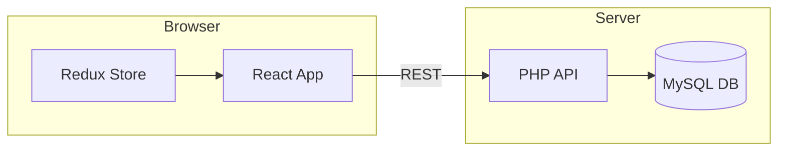

# Frontend Implementation Details

此文件介紹前端程式碼與主要功能，程式碼位於 `front/` 目錄。

## Overview

前端採用 React 19 搭配 React Router v7、Redux Toolkit 以及 Ant Design UI 套件建置。
透過自訂 Hook 與 Context 管理通知與主題，並與後端 REST API 溝通。

## 功能簡述

- 商品瀏覽與篩選
- 登入／登出與購物車管理
- 會員資料查詢與購買紀錄
- 店家管理介面 (商品與訂單)

## Architecture

以下以 Mermaid 繪製簡易架構圖：



## Framework Usage

### React Hooks
- `useState`
- `useEffect`
- `useContext`
- `useRef`
- `useMemo`
- 自訂 `useNotification`

### Redux
- `useSelector`
- `useDispatch`
- `configureStore` / `createSlice`

### Routing (react-router-dom v7)
- `BrowserRouter`
- `Routes` / `Route`
- `Link`
- `Outlet`
- `useNavigate`
- `useLocation`

### Ant Design Hooks
- `Form.useForm`
- `theme.useToken`

## Project Structure (simplified)

```
front/
  ├── public/
  └── src/
      ├── components/
      ├── pages/
      ├── store/
      ├── assets/
      └── styles/
```

