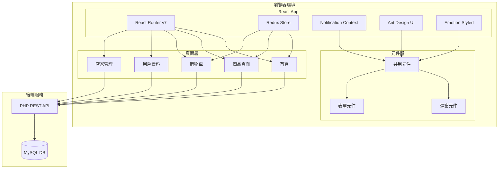

# Frontend Implementation Details

此文件介紹前端程式碼與主要功能，程式碼位於 `front/` 目錄。

## Overview

前端採用 **React 19** 搭配 **React Router v7**、**Redux Toolkit** 以及 **Ant Design v5** UI 套件建置。
透過自訂 Hook 與 Context 管理通知與主題，並與後端 REST API 溝通。

## 核心技術棧

### 主要框架與庫
- **React 19.1.0** - 核心框架
- **React DOM 19.1.0** - DOM 操作
- **React Router DOM 7.6.0** - 客戶端路由
- **Redux Toolkit 2.8.2** - 狀態管理
- **React Redux 9.2.0** - React 與 Redux 的連接
- **Ant Design 5.25.3** - UI 元件庫
- **@ant-design/icons 5.6.1** - 圖標庫

### 樣式與動畫
- **@emotion/react 11.14.0** - CSS-in-JS 樣式庫
- **@emotion/styled 11.14.0** - 樣式組件
- **normalize.css 8.0.1** - 瀏覽器樣式標準化

### 資料請求與工具
- **axios** - HTTP 請求庫（全域配置）
- **qs** - 查詢字符串處理（全域配置）
- **dayjs 1.11.10** - 日期處理庫
- **@tanstack/react-query 5.76.1** - 資料獲取與快取

### 測試工具
- **@testing-library/react 16.3.0** - React 元件測試
- **@testing-library/jest-dom 6.6.3** - Jest DOM 匹配器
- **@testing-library/user-event 13.5.0** - 用戶事件模擬
- **@testing-library/dom 10.4.0** - DOM 測試工具

### 開發工具
- **React Scripts 5.0.1** - 建置與開發工具
- **web-vitals 2.1.4** - 性能監控

## 功能簡述

- **商品瀏覽與篩選** - 完整的商品展示與分類篩選功能
- **登入／登出與購物車管理** - JWT 認證系統與購物車狀態管理
- **會員資料查詢與購買紀錄** - 用戶個人資料管理與訂單歷史
- **店家管理介面** - 商品與訂單管理系統
- **即時通知系統** - 自訂通知元件與 Context

## Architecture



## React Hooks 使用

### 原生 React Hooks
- **`useState`** - 元件狀態管理
- **`useEffect`** - 副作用處理與生命週期
- **`useContext`** - Context 資料存取
- **`useRef`** - DOM 引用（較少使用）
- **`useMemo`** - 效能最佳化（計算結果快取）

### React Router Hooks
- **`useNavigate`** - 程式化導航
- **`useLocation`** - 當前路由資訊存取

### Redux Hooks
- **`useSelector`** - Redux 狀態選取
- **`useDispatch`** - Redux Action 分發

### Ant Design Hooks
- **`Form.useForm`** - 表單控制
- **`theme.useToken`** - 主題 token 存取

### 自訂 Hooks
- **`useNotification`** - 全域通知系統
  ```javascript
  const { notify } = useNotification();
  notify.success('標題', '描述');
  notify.error('錯誤', '錯誤描述');
  ```

## Redux 狀態管理

### Store 配置
```javascript
// store/index.js
export const store = configureStore({
  reducer: {
    cart: cartReducer
  },
  devTools: process.env.NODE_ENV !== 'production'
});
```

### Slice 設計
- **cartSlice** - 購物車狀態管理
  - Actions: `addToCart`, `removeFromCart`, `updateQuantity`, `clearCart`
  - Selectors: `selectCartItems`, `selectCartItemCount`, `selectTotalPrice`

## 路由配置 (React Router v7)

### 主要路由
- `/` - 首頁 (HomePage)
- `/products` - 商品列表 (ProductsPage)
- `/cart` - 購物車 (CartPage)
- `/user-profile` - 用戶資料 (UserProfilePage)
- `/purchase-history` - 購買紀錄 (PurchaseHistoryPage)

### 店家管理路由
- `/store` - 店家管理佈局 (StoreLayout)
  - `/store/products` - 商品管理 (ProductManagement)
  - `/store/orders` - 訂單管理 (OrderManagement)

### 錯誤處理
- `*` - 404 頁面 (NotFoundPage)

## 核心元件架構

### 應用程式結構
```
App (NotificationProvider + AntApp Wrapper)
├── AppContent (主要應用邏輯)
    ├── Layout (Ant Design Layout)
    ├── Header (導航選單)
    ├── Content (路由內容)
    └── LoginModal (登入彈窗)
```

### 共用元件
- **LoginModal** - 登入彈窗
- **ProductDetailModal** - 商品詳情彈窗
- **ProductForm** - 商品表單
- **Notification** - 通知系統

### 頁面元件
- **HomePage** - 首頁與推薦商品
- **ProductsPage** - 商品列表與篩選
- **CartPage** - 購物車管理
- **UserProfilePage** - 用戶資料編輯
- **PurchaseHistoryPage** - 購買紀錄與統計
- **Store/*** - 店家管理頁面

## HTTP 請求與認證

### Request 配置
```javascript
// utils/Request.js
const Request = () => {
  const instance = axios.create({
    baseURL: API_CONFIG.baseURL,
    headers: {
      'Content-Type': 'application/x-www-form-urlencoded',
    },
  });
  
  // 請求攔截器 - 自動添加 JWT Token
  instance.interceptors.request.use((config) => {
    const token = getToken();
    if (token) {
      config.headers.Auth = token;
    }
    return config;
  });
  
  // 回應攔截器 - 自動更新 Token
  instance.interceptors.response.use((response) => {
    if (response.data && response.data.token) {
      setToken(response.data.token);
    }
    return response;
  });
  
  return instance;
};
```

### 認證管理
- **TokenManager** - Token 過期管理
- **auth.js** - Token 存取工具函數
  - `getToken()` - 從 localStorage 獲取 token
  - `setToken(token)` - 儲存 token
  - `removeToken()` - 移除 token

## 樣式系統

### 主題配置
```javascript
// styles/styles.js
export const themeConfig = {
  token: {
    colorPrimary: '#2B2118',
    colorSuccess: '#52c41a',
    colorWarning: '#faad14',
    colorError: '#f5222d',
    colorInfo: '#1677ff',
    borderRadius: 4,
    fontSize: 14,
  },
};
```

### 樣式組織
- **styles.js** - 全域樣式與主題配置
- **pageStyles.js** - 頁面專用樣式
- **homePageStyles.js** - 首頁樣式
- **cartPageStyles.js** - 購物車樣式
- **userProfileStyles.js** - 用戶資料頁樣式
- **storeStyles.js** - 店家管理樣式
- **notFoundStyles.js** - 404 頁面樣式

### 樣式技術
- **Ant Design ConfigProvider** - 全域主題配置
- **Emotion Styled Components** - 特殊樣式需求
- **CSS Modules** - 部分元件樣式

## 通知系統架構

### NotificationProvider
```javascript
// components/Notification.js
export const NotificationProvider = ({ children }) => {
  const [notifications, setNotifications] = useState([]);
  
  const notify = {
    success: (title, description) => addNotification({ title, description, type: 'success' }),
    info: (title, description) => addNotification({ title, description, type: 'info' }),
    warning: (title, description) => addNotification({ title, description, type: 'warning' }),
    error: (title, description) => addNotification({ title, description, type: 'error' })
  };
  
  return (
    <NotificationContext.Provider value={{ notify }}>
      {children}
      <NotificationContainer>
        {notifications.map(notification => (
          <Notification key={notification.id} {...notification} />
        ))}
      </NotificationContainer>
    </NotificationContext.Provider>
  );
};
```

## 資產管理

### 圖片資源
```
src/assets/images/
├── accessories/ - 配件類商品圖片
├── food/ - 食品類商品圖片
└── toy/ - 玩具類商品圖片
```

### 圖片處理
- 自動根據商品類別載入對應圖片
- 支援圖片延遲載入
- 圖片格式標準化處理

## 配置管理

### API 配置
```javascript
// config.js
export const API_CONFIG = {
  baseURL: "http://localhost/FinalProj/backend/public/index.php",
  assetBaseURL: "http://localhost/FinalProj/backend/",
}

export function getApiUrl(action) {
  return `${API_CONFIG.baseURL}?action=${action}`;
}
```

## 效能最佳化

### 程式碼分割
- 使用 React.lazy 和 Suspense 進行動態載入
- 路由層級的程式碼分割

### 狀態管理最佳化
- Redux Toolkit 內建的效能最佳化
- 使用 useSelector 精確選取所需狀態
- 避免不必要的重新渲染

### 請求最佳化
- 使用 React Query 進行資料快取
- 請求去重複與錯誤重試機制
- Token 自動更新機制

## 開發與建置

### 開發指令
```bash
npm start      # 開發環境
npm build      # 生產建置
npm test       # 執行測試
npm eject      # 彈出 CRA 配置
```

### 開發環境配置
- **React Scripts** - 建置工具鏈
- **ESLint** - 程式碼規範檢查
- **Jest** - 單元測試框架
- **React Testing Library** - 元件測試

## Project Structure (detailed)

```
front/
├── public/                 # 靜態資源
├── src/
│   ├── components/         # 共用元件
│   │   ├── LoginModal.js
│   │   ├── Notification.js
│   │   ├── ProductDetailModal.js
│   │   └── ProductForm.js
│   ├── pages/              # 頁面元件
│   │   ├── Store/          # 店家管理子頁面
│   │   │   ├── OrderManagement.js
│   │   │   ├── ProductManagement.js
│   │   │   └── StoreLayout.js
│   │   ├── CartPage.js
│   │   ├── HomePage.js
│   │   ├── NotFoundPage.js
│   │   ├── ProductsPage.js
│   │   ├── PurchaseHistoryPage.js
│   │   └── UserProfilePage.js
│   ├── store/              # Redux 狀態管理
│   │   ├── cartSlice.js
│   │   └── index.js
│   ├── utils/              # 工具函數
│   │   ├── Request.js
│   │   ├── auth.js
│   │   └── tokenManager.js
│   ├── styles/             # 樣式檔案
│   │   ├── cartPageStyles.js
│   │   ├── homePageStyles.js
│   │   ├── notFoundStyles.js
│   │   ├── pageStyles.js
│   │   ├── storeStyles.js
│   │   ├── styles.js
│   │   └── userProfileStyles.js
│   ├── assets/             # 靜態資源
│   │   └── images/
│   │       ├── accessories/
│   │       ├── food/
│   │       └── toy/
│   ├── App.js              # 主應用元件
│   ├── config.js           # API 配置
│   ├── index.js            # 應用入口
│   └── index.css           # 全域樣式
├── package.json            # 專案配置與依賴
└── README.md               # 專案說明
```

## 技術決策說明

### 為什麼選擇這些技術？

1. **React 19** - 最新的 React 版本，提供更好的並發功能和效能
2. **Redux Toolkit** - 簡化 Redux 的使用，減少樣板程式碼
3. **Ant Design v5** - 企業級 UI 元件庫，提供完整的設計系統
4. **React Router v7** - 最新的路由解決方案，支援資料載入和錯誤邊界
5. **Emotion** - 靈活的 CSS-in-JS 解決方案，與 Ant Design 良好整合
6. **Axios** - 功能強大的 HTTP 客戶端，支援攔截器和自動轉換

### 架構設計原則

1. **關注點分離** - 將業務邏輯、UI 邏輯和資料管理分開
2. **可重用性** - 建立可重用的元件和工具函數
3. **型別安全** - 使用 PropTypes 或準備遷移到 TypeScript
4. **效能導向** - 使用 React 的最佳實踐和效能最佳化技術
5. **使用者體驗** - 提供流暢的互動和即時反饋

這個前端專案展現了現代 React 應用程式的完整架構，整合了狀態管理、路由、UI 元件庫和自訂系統，為使用者提供了完整的電商購物體驗。

