# Frontend Implementation Details (v3.2.1)

此文件詳細介紹前端程式碼與主要功能，記錄了系統從 Redux 狀態管理遷移至 **API 驅動 + 本地狀態 + 樂觀更新**，再到 **Redux + 後端 API 混合整合** 的完整演進過程。程式碼位於 `front/` 目錄。

## Overview

前端採用 **React 19** 建置，核心目標是提供一個反應快速、體驗流暢的寵物用品電商介面。系統經歷了多次架構演進：
1. **v1.0**: 純 Redux 狀態管理
2. **v2.0**: API 驅動 + 本地狀態 + 樂觀更新
3. **v3.2.1**: **Redux + 後端 API 混合整合**，實現了統一的購物車狀態管理

當前版本整合了 Redux 全域狀態管理與後端 API 的優勢，通過智能選擇器和非同步 thunk 實現了即時的購物車數量同步，同時保持了樂觀更新的流暢體驗。

## 核心技術棧

### 主要框架與庫
- **React 19.1.0** - 核心 UI 框架
- **React DOM 19.1.0** - DOM 操作
- **React Router DOM 7.6.0** - 客戶端路由管理
- **Ant Design 5.25.3** - 企業級 UI 元件庫
- **@ant-design/icons 5.6.1** - 圖標庫

### 狀態管理
- **React Hooks (`useState`, `useEffect`, `useContext`)** - 頁面本地狀態和跨元件共享狀態管理。
- **Redux Toolkit 2.8.2 / React Redux 9.2.0** - **（v3.2.1 重新整合）** 用於全域狀態管理，特別是購物車數量徽章的即時同步。通過 `fetchCartStatistics` async thunk 實現與後端 API 的完整整合。

### 樣式與動畫
- **@emotion/react 11.14.0** & **@emotion/styled 11.14.0** - CSS-in-JS 樣式方案，用於撰寫元件級別的動態樣式。
- **normalize.css 8.0.1** - 瀏覽器樣式標準化。

### 資料請求與工具
- **axios** - 全域配置的 HTTP 請求庫，透過攔截器自動處理認證 Token。
- **qs** - 查詢字串處理，用於 `x-www-form-urlencoded` 格式的請求。

## Architecture

系統架構從 Redux-centric → API-centric → **Redux + API 混合整合**。

```mermaid
flowchart TB
    %% ----- 前端 -----
    subgraph "瀏覽器環境 (Browser)"
        subgraph "React App"
            Router[React Router v7]
            Context["React Context<br/>(Notification)"]
            AntD["Ant Design UI"]
            Emotion["Emotion Styled"]
            Redux["Redux Store<br/>with API Integration"]
        end

        subgraph "頁面層 (Pages)"
            HomePage[首頁]
            ProductsPage[商品頁]
            CartPage["購物車 (API + Local State)"]
            UserProfile[用戶資料]
            StoreManagement[店家管理]
        end

        subgraph "服務與元件層 (Services & Components)"
            CartService[cartService.js]
            Components[共用元件]
        end
    end

    %% ----- 後端 -----
    subgraph "後端服務 (Backend)"
        API[PHP REST API]
        DB[(MySQL DB)]
    end

    %% --- 路由關係 ---
    Router --> HomePage
    Router --> ProductsPage
    Router --> CartPage
    Router --> UserProfile
    Router --> StoreManagement

    %% --- 混合資料流 (v3.2.1) ---
    CartPage -- "useState + useEffect" --> CartService
    HomePage -- "Add to Cart + Redux refresh" --> CartService
    ProductsPage -- "Add to Cart + Redux refresh" --> CartService
    CartPage -- "Operations + Redux refresh" --> Redux
    StoreManagement -- "Direct API" --> API
    CartService -- axios --> API
    Redux -- "fetchCartStatistics thunk" --> API
    API --> DB

    %% --- UI 元件關係 ---
    Context --> Components
    AntD --> Components
    AntD --> HomePage
    AntD --> ProductsPage
    AntD --> CartPage
    AntD --> UserProfile
    AntD --> StoreManagement
    Emotion --> Components

    %% --- Redux 整合關係 (v3.2.1) ---
    Redux -- "selectCartItemCount" --> Router
    Components --> HomePage
    Components --> ProductsPage
    Components --> CartPage
    Components --> UserProfile
    Components --> StoreManagement
```



## 狀態管理策略 (State Management Strategy)

### 1. 本地狀態 (Local State) - `useState` & `useEffect`
主要用於頁面級別的狀態管理，特別是在 `CartPage.js` 中。
- **`useState`**: 用於管理頁面自身的所有狀態，如購物車商品列表 (`cartItems`)、統計數據 (`cartStats`)、載入狀態 (`loading`, `checkoutLoading`) 等。這使得元件狀態內聚，易於理解和維護。
- **`useEffect`**: 用於處理副作用。例如，在 `CartPage.js` 中，它被用來在用戶資訊 (`user`) 載入後，觸發 `loadCartData` 函數以從後端獲取購物車資料。

### 2. 跨元件共享狀態 - `useContext`
- 用於提供全域功能，而非全域資料。
- **`NotificationProvider` (`components/Notification.js`)**: 透過 Context 提供一個全域的 `notify` 函數，讓任何元件都能輕易地觸發成功、失敗、警告等通知，而無需透過 props 逐層傳遞。

### 3. Redux + 後端 API 混合整合 (v3.2.1) - `Redux Toolkit`
- **完整的 Redux + API 整合**，實現了統一的購物車狀態管理系統。
- **`store/cartSlice.js`**: 
  - **Enhanced State**: 包含 `items`、`statistics`、`loading`、`error` 等完整狀態
  - **Async Thunk**: `fetchCartStatistics` 用於從後端獲取購物車統計
  - **Smart Selectors**: `selectCartItemCount` 優先使用後端數據，本地數據作為備選
- **使用場景**:
  - **購物車數量徽章**: 在 `App.js` 導覽列顯示即時的購物車商品總數
  - **跨頁面狀態同步**: 所有頁面的購物車操作都會觸發 Redux 更新
  - **統一數據來源**: 後端 API 作為主要數據來源，Redux 作為全域緩存
- **自動刷新機制**:
  - **登入/登出時**: 自動載入/清空購物車統計
  - **定期刷新**: 每30秒自動更新
  - **操作後刷新**: 所有購物車操作完成後立即更新

## React Hooks 使用詳解

- **`useState`**:
  - **`CartPage.js`**: `const [cartItems, setCartItems] = useState([])` - 儲存和更新購物車商品列表，是樂觀更新的核心。
  - **`ProductsPage.js`**: `const [products, setProducts] = useState([])` - 儲存從後端獲取的商品列表。
  - **`OrderManagement.js`**: `const [orders, setOrders] = useState([])` - 管理訂單列表。

- **`useEffect`**:
  - **`CartPage.js`**: `useEffect(() => { loadCartData(); }, [user])` - 監聽 `user` 物件的變化，一旦用戶登入成功，就自動載入其購物車資料。
  - **`App.js`**: `useEffect(() => { checkAuthStatus(); }, [])` - 在應用程式首次加載時執行一次，用於檢查本地儲存的 Token 以恢復用戶登入狀態。

- **`useContext`**:
  - **`useNotification` (`components/Notification.js`)**: 幾乎在所有需要用戶反饋的頁面（如 `CartPage`, `ProductsPage`, `HomePage`）中被調用，以顯示操作結果的通知。`const { notify } = useNotification()`。

- **`useNavigate`** (from React Router):
  - **`HomePage.js`**: `navigate('/products')` - 點擊按鈕後導航到商品頁面。
  - **`CartPage.js`**: `navigate('/purchase-history')` - 結帳成功後導航到購買紀錄頁面。

- **`useDispatch` / `useSelector`** (from React Redux - **v3.2.1 重新整合**):
  - **`useDispatch`**:
    - **`App.js`**: `dispatch(fetchCartStatistics(user.account_id))` - 登入/登出時更新購物車統計
    - **`ProductsPage.js` / `HomePage.js`**: 加入購物車後觸發 `dispatch(fetchCartStatistics())`
    - **`CartPage.js`**: 所有購物車操作完成後觸發 Redux 更新
  - **`useSelector`**:
    - **`App.js`**: `const cartItemCount = useSelector(selectCartItemCount)` - 從 Redux store 中讀取購物車商品總數，優先使用後端數據

## Project Structure (Detailed)

```
front/
├── public/                 # 靜態資源 (index.html, manifest.json)
├── src/
│   ├── components/         # 共用元件
│   │   ├── LoginModal.js     # 登入彈窗
│   │   ├── RegisterModal.js  # 註冊彈窗
│   │   ├── Notification.js   # 全域通知系統 (Provider & Hook)
│   │   ├── ProductDetailModal.js # 商品詳情彈窗
│   │   └── ProductForm.js    # 商品表單組件
│   │
│   ├── pages/              # 頁面元件
│   │   ├── CartPage.js       # 【核心】購物車頁面，實現樂觀更新，使用useState和cartService
│   │   ├── HomePage.js       # 首頁，"加入購物車"已改用cartService
│   │   ├── ProductsPage.js   # 商品列表頁，"加入購物C"已改用cartService
│   │   └── ... (其他頁面)
│   │
│   ├── services/           # 【新】服務層
│   │   └── cartService.js    # 【核心】封裝所有購物車相關的後端API調用
│   │
│   ├── store/              # 【v3.2.1 重新整合】Redux 狀態管理
│   │   ├── cartSlice.js      # 完整的購物車 Redux 邏輯 + 後端 API 整合
│   │   └── index.js          # 設定 Redux store
│   │
│   ├── utils/              # 工具函數
│   │   ├── Request.js        # 設定全域 axios 實例與攔截器
│   │   └── auth.js           # 處理 Token 的讀取、設定、移除
│   │
│   ├── styles/             # Emotion 樣式檔案
│   │   └── ...
│   │
│   ├── assets/             # 靜態資源 (圖片)
│   │   └── ...
│   │
│   ├── App.js              # 主應用元件，設定路由、佈局和認證檢查
│   ├── config.js           # API 路徑等環境配置
│   ├── index.js            # 應用程式入口，掛載React App與Redux Provider
│   └── ...
└── package.json            # 專案配置與依賴
```

## 核心功能資料流 (Core Functionality Data Flow)

### 1. 用戶註冊流程 (User Registration Flow)
1. **使用者操作**: 在登入模態框中點擊「立即註冊」按鈕
2. **元件切換**: `LoginModal` 開啟 `RegisterModal` 子元件
3. **表單驗證**: 
   - 前端驗證：帳號格式(3-10字元英數)、Email格式、密碼確認、必填欄位
   - 即時反饋：表單項目失焦時進行驗證
4. **API 調用**: 
   - 呼叫 `newUser` API，傳送註冊資料
   - 包含必填項目(帳號、Email、密碼、姓名)和選填項目(地址、生日)
5. **後端處理**:
   - 參數驗證與格式檢查
   - 帳號和Email唯一性檢查
   - 建立用戶帳戶、角色關聯、購物車初始化
   - 完整性驗證與錯誤回滾機制
6. **成功處理**:
   - 顯示個人化成功通知(包含用戶姓名和帳號)
   - 自動填入登入表單的帳號欄位
   - 關閉註冊模態框，回到登入介面
7. **錯誤處理**:
   - 顯示詳細錯誤訊息(帳號重複、Email已註冊等)
   - 保持註冊表單開啟，讓用戶修正資料

### 2. 加入商品到購物車 (On `ProductsPage` / `HomePage`) - v3.2.1 更新
1.  **使用者操作**: 點擊「加入購物車」按鈕。
2.  **登入檢查**: 首先檢查用戶是否已登入，未登入則顯示登入提示
3.  **事件處理**: 觸發 `handleAddToCart(product)` 函數。
4.  **API 調用**: 調用 `await cartService.addToCart(userId, productId, 1)`。
5.  **服務層**: `cartService` 透過 `axios` 向後端發送 `POST` 請求。
6.  **UI 反饋**: 請求成功後，使用 `useNotification` 顯示成功訊息。
7.  **Redux 同步**: **立即觸發** `dispatch(fetchCartStatistics(user.account_id))` 更新全域狀態。
8.  **即時更新**: 導覽列的購物車徽章立即顯示最新數量，實現完美的跨頁面同步。

### 3. 管理購物車 (On `CartPage`) - **樂觀更新 + Redux 同步** (v3.2.1)
1.  **初始載入**: `useEffect` 觸發 `loadCartData`，調用 `cartService.getCart` 獲取資料，並用 `setCartItems` 和 `setCartStats` 存入本地 state。
2.  **使用者操作**: 點擊商品數量的「+」按鈕。
3.  **事件處理**: 觸發 `handleQuantityChange(itemId, newQuantity)`。
4.  **樂觀更新 - UI先行**:
    a.  `const previousItems = [...cartItems]` - 保存當前狀態以備回滾。
    b.  `setCartItems(updatedItems)` - **立即更新** UI，使用者感覺不到延遲。
    c.  `updateCartStats(updatedItems)` - 同步更新總價等統計數據。
5.  **API 調用 (背景)**: 執行 `await cartService.updateCartItem(...)`。
6.  **結果處理**:
    - **成功**: API 返回成功。觸發 `dispatch(fetchCartStatistics(user.account_id))` 同步 Redux 狀態。
    - **失敗**: 進入 `catch` 區塊，**執行回滾**：`setCartItems(previousItems)`，將 UI 恢復到操作前的狀態，並顯示錯誤通知。
7.  **全域同步**: 所有操作（增加、減少、移除、清空、結帳）完成後都會更新 Redux，確保導覽列徽章即時同步。

## 技術決策演進

### 架構演進歷程
1.  **v1.0 - 純 Redux**: 所有狀態都由 Redux 管理，包括購物車資料
2.  **v2.0 - API 驅動**: 將購物車狀態管理從 Redux 遷移到 API + 本地狀態
3.  **v3.2.1 - 混合整合**: Redux + API 完整整合，實現最佳的使用者體驗

### 為什麼經歷 Redux → API → Redux 的演進？

#### v1.0 → v2.0 遷移原因：
1.  **簡化複雜度**: Redux 的樣板程式碼（Actions, Reducers, Dispatch）對於購物車這類強依賴後端的功能過於繁瑣
2.  **提升使用者體驗**: 樂觀更新模式將 UI 更新提前，提供即時的交互反饋
3.  **API 成為單一事實來源**: 後端資料庫才是真正的"事實來源"，前端狀態應視為後端資料的快照

#### v2.0 → v3.2.1 回歸整合原因：
1.  **跨頁面同步問題**: 純 API 模式無法解決購物車徽章的即時更新問題
2.  **狀態一致性**: 需要全域狀態來確保不同頁面間的資料一致性
3.  **最佳實踐**: 結合 Redux 的全域狀態管理優勢和 API 的即時資料優勢

### v3.2.1 的優勢：
- ✅ **即時同步**: 所有頁面的購物車操作都會立即反映在導覽列徽章
- ✅ **樂觀更新**: 保持了流暢的使用者體驗
- ✅ **資料一致性**: 後端 API 作為主要資料來源，Redux 作為全域快取
- ✅ **錯誤恢復**: 失敗時能正確回滾狀態
- ✅ **自動刷新**: 登入/登出和定期刷新機制確保資料始終最新

## 註冊功能深度解析 (Registration Feature Deep Dive)

### 註冊系統架構設計

#### 多層次使用者體驗設計
1. **無縫整合**: 註冊功能完全整合在登入流程中，用戶無需離開當前頁面
2. **漸進式表單**: 從必填欄位到選填欄位的邏輯排列
3. **即時驗證**: 表單欄位失焦時進行即時驗證，提供即時反饋
4. **智能跳轉**: 註冊成功後自動填入登入表單，減少用戶操作步驟

#### 表單設計模式
```javascript
// 註冊表單結構
const formFields = {
  required: {
    account_code: "帳號 (3-10字元英數)",
    email: "電子郵件",
    name: "姓名",
    password: "密碼 (至少6字元)",
    confirmPassword: "確認密碼"
  },
  optional: {
    addr: "地址",
    birth: "生日 (DatePicker)"
  }
};
```

### 前端驗證機制

#### 即時驗證規則
```javascript
// 帳號驗證
{
  required: true,
  min: 3, max: 10,
  pattern: /^[a-zA-Z0-9]+$/,
  message: "帳號只能包含英文字母和數字"
}

// 密碼確認驗證
const validateConfirmPassword = (_, value) => {
  if (!value || form.getFieldValue('password') === value) {
    return Promise.resolve();
  }
  return Promise.reject(new Error('兩次輸入的密碼不一致！'));
};
```

#### 日期處理整合
```javascript
// dayjs 整合處理生日欄位
const postData = {
  // ... 其他欄位
  bir: values.birth ? dayjs(values.birth).format('YYYY-MM-DD') : ''
};
```

### 後端整合策略

#### API 調用封裝
```javascript
// 註冊 API 調用
const res = await Request().post(
  getApiUrl('newUser'), 
  Qs.stringify(postData)
);
```

#### 錯誤處理分層
1. **網路層錯誤**: 連線超時、伺服器無回應
2. **業務邏輯錯誤**: 帳號重複、Email已註冊
3. **參數驗證錯誤**: 格式不正確、必填欄位遺漏

### 通知系統整合

#### 雙重通知機制
```javascript
// 全域通知系統 - 詳細訊息
notify.success(
  '🎉 註冊成功！',
  `歡迎加入 ${response.full_name}！您的帳號是 ${response.account_code}`
);

// Ant Design Message - 簡短確認
message.success('註冊成功！');
```

#### 個人化訊息設計
- **成功訊息**: 包含用戶姓名和帳號，增加親切感
- **錯誤訊息**: 提供具體的修正建議
- **警告訊息**: 網路問題時提供故障排除指引

### 用戶體驗優化

#### 智能表單管理
1. **自動焦點**: 表單開啟時自動聚焦第一個欄位
2. **Tab 順序**: 邏輯化的 Tab 切換順序
3. **Enter 提交**: 支援 Enter 鍵快速提交
4. **表單記憶**: 錯誤時保留已填入的正確資料

#### 視覺設計整合
```javascript
// 統一的視覺設計語言
const modalConfig = {
  title: (
    <div style={{ textAlign: 'center', fontSize: '18px', fontWeight: 'bold' }}>
      <UserOutlined style={{ marginRight: '8px', color: '#52c41a' }} />
      會員註冊
    </div>
  ),
  width: 480,
  centered: true,
  destroyOnClose: true
};
```

### 狀態管理整合

#### 父子元件通信
```javascript
// LoginModal 中的註冊按鈕
<Button 
  type="link" 
  onClick={() => setRegisterModalVisible(true)}
>
  立即註冊
</Button>

// 註冊成功後的回調處理
const handleRegisterSuccess = (response) => {
  // 填入登入表單的帳號欄位
  loginForm.setFieldsValue({
    account_code: response.account_code
  });
  
  // 聚焦密碼欄位，引導用戶完成登入
  setTimeout(() => {
    const passwordInput = document.querySelector('input[type="password"]');
    passwordInput?.focus();
  }, 100);
};
```

#### 表單狀態同步
- **重置機制**: 取消或成功時自動重置表單
- **載入狀態**: 提交期間顯示載入動畫
- **防重複提交**: 提交期間禁用提交按鈕

### 安全性考量

#### 前端安全驗證
1. **輸入清理**: 防止 XSS 攻擊
2. **格式驗證**: 確保資料格式正確
3. **長度限制**: 防止過長輸入造成問題

#### 密碼安全
- **明文顯示控制**: 密碼欄位支援顯示/隱藏切換
- **確認機制**: 雙重密碼輸入確認
- **強度指引**: 提供密碼強度建議

### 未來擴展性

#### 可擴展的表單架構
- **動態欄位**: 支援根據業務需求動態添加欄位
- **條件驗證**: 支援根據其他欄位值進行條件驗證
- **多步驟表單**: 架構支援分步驟的複雜註冊流程

#### 國際化準備
- **多語言支援**: 錯誤訊息和標籤支援多語言
- **地區客製化**: 支援不同地區的註冊需求

### 效能最佳化

#### 減少不必要的渲染
```javascript
// 使用 React.memo 優化元件
const RegisterModal = React.memo(({ visible, onCancel, onSuccess }) => {
  // ... 元件實作
});

// useCallback 優化事件處理函數
const handleRegister = useCallback(async (values) => {
  // ... 處理邏輯
}, [notify]);
```

#### 懶載入策略
- **條件載入**: 只有在需要時才載入註冊元件
- **代碼分割**: 可考慮將註冊功能分離成獨立的 chunk

這個註冊功能實現展現了現代前端應用的完整用戶註冊體驗，從表單設計到錯誤處理，從狀態管理到安全性考量，每個細節都經過精心設計，為用戶提供了流暢、安全、直觀的註冊體驗。

這個前端專案展現了從傳統全域狀態管理 → API 驅動架構 → Redux + API 混合整合的完整演進過程，最終實現了兼具即時性、一致性和使用者體驗的理想架構。

## 完整檔案結構與詳細說明 (Complete File Structure)

```
front/
├── public/                 # 靜態資源
│   ├── index.html            # 應用程式主 HTML 模板
│   ├── manifest.json         # PWA 配置檔案
│   ├── robots.txt            # 搜尋引擎爬蟲指令
│   └── favicon.ico           # 網站圖標
│
├── src/                    # 主要原始碼目錄
│   ├── components/         # 共用元件 (Component Library)
│   │   │
│   │   ├── LoginModal.js     # 登入彈窗元件 (130行)
│   │   │                     # - 表單驗證與提交
│   │   │                     # - JWT Token 處理
│   │   │                     # - 整合註冊功能入口
│   │   │                     # - 使用：App.js
│   │   │
│   │   ├── RegisterModal.js  # 【新增】註冊彈窗元件 (239行)
│   │   │                     # - 完整的註冊表單(7個欄位)
│   │   │                     # - 前端表單驗證與後端API整合
│   │   │                     # - 密碼確認驗證
│   │   │                     # - 日期選擇器整合(dayjs)
│   │   │                     # - 個人化成功/錯誤通知
│   │   │                     # - 自動填入登入表單
│   │   │                     # - 使用：LoginModal.js
│   │   │
│   │   ├── Notification.js   # 【核心】全域通知系統 (253行)
│   │   │                     # - NotificationProvider (Context)
│   │   │                     # - useNotification Hook
│   │   │                     # - 自動關閉、動畫效果
│   │   │                     # - 四種類型：success/info/warning/error
│   │   │
│   │   ├── ProductDetailModal.js # 商品詳情彈窗 (118行)
│   │   │                     # - 商品圖片、描述、規格顯示
│   │   │                     # - 加入購物車功能
│   │   │                     # - 使用：ProductsPage.js, HomePage.js
│   │   │
│   │   └── ProductForm.js    # 商品表單元件 (91行)
│   │                         # - 新增/編輯商品
│   │                         # - 圖片上傳處理
│   │                         # - 使用：ProductManagement.js
│   │
│   ├── pages/              # 頁面元件 (Page Components)
│   │   ├── CartPage.js       # 【核心】購物車頁面 (530行)
│   │   │                     # - 樂觀更新實現
│   │   │                     # - 商品數量管理 (+/- 按鈕, InputNumber)
│   │   │                     # - 商品移除、清空功能
│   │   │                     # - 價格計算與統計
│   │   │                     # - 結帳流程整合
│   │   │                     # - Hooks: useState, useEffect, useNotification, useNavigate
│   │   │
│   │   ├── HomePage.js       # 首頁 (181行)
│   │   │                     # - 歡迎資訊與導覽
│   │   │                     # - 推薦商品展示 (前8項)
│   │   │                     # - 商品卡片與加入購物車
│   │   │                     # - API: getProducts, cartService.addToCart
│   │   │
│   │   ├── ProductsPage.js   # 商品列表頁 (323行)
│   │   │                     # - 商品篩選 (類別、價格排序)
│   │   │                     # - 商品網格/列表檢視
│   │   │                     # - 庫存顯示與庫存檢查
│   │   │                     # - 登入狀態檢查 (加入購物車前)
│   │   │                     # - API: getProducts, cartService.addToCart
│   │   │
│   │   ├── UserProfilePage.js # 用戶資料頁 (225行)
│   │   │                     # - 個人資料編輯
│   │   │                     # - 密碼修改功能
│   │   │                     # - API: getUser, updateUser
│   │   │
│   │   ├── PurchaseHistoryPage.js # 購買紀錄頁 (520行)
│   │   │                     # - 訂單歷史查詢
│   │   │                     # - 訂單詳情檢視
│   │   │                     # - 統計資訊顯示
│   │   │                     # - API: getOrders, getOrderDetail
│   │   │
│   │   ├── NotFoundPage.js   # 404 錯誤頁面 (40行)
│   │   │                     # - 簡潔的錯誤提示
│   │   │                     # - 返回首頁連結
│   │   │
│   │   └── Store/          # 店家管理子模組
│   │       ├── StoreLayout.js    # 店家管理佈局 (62行)
│   │       │                     # - 側邊選單導覽
│   │       │                     # - 權限檢查 (role_id === 1)
│   │       │
│   │       ├── ProductManagement.js # 商品管理頁 (209行)
│   │       │                     # - 商品 CRUD 操作
│   │       │                     # - 圖片上傳與預覽
│   │       │                     # - API: getProducts, addProduct, updateProduct, deleteProduct
│   │       │
│   │       └── OrderManagement.js # 訂單管理頁 (354行)
│   │                             # - 訂單狀態更新
│   │                             # - 訂單取消與庫存回滾
│   │                             # - 訂單詳情檢視
│   │                             # - API: getOrders, updateOrderStatus, removeOrder
│   │
│   ├── services/           # 【新架構】服務層 (Service Layer)
│   │   └── cartService.js    # 【核心】購物車 API 服務 (94行)
│   │                         # - 封裝 6 個購物車 API
│   │                         # - 統一參數處理與錯誤格式
│   │                         # - 單例模式 (Singleton Pattern)
│   │                         # - Methods: getCart, addToCart, updateCartItem, 
│   │                         #           removeFromCart, clearCart, getCartStatistics
│   │
│   ├── store/              # 【v3.2.1 重新整合】Redux 狀態管理
│   │   ├── index.js          # Redux Store 配置
│   │   │                     # - configureStore 設定
│   │   │                     # - 開發工具配置
│   │   │
│   │   └── cartSlice.js      # 【完整整合】購物車 Slice (Redux Toolkit)
│   │                         # - Enhanced State: items, statistics, loading, error
│   │                         # - Async Thunk: fetchCartStatistics
│   │                         # - Smart Selectors: 優先使用後端數據
│   │                         # - 完整的 Redux + API 整合邏輯
│   │
│   ├── utils/              # 工具函數 (Utility Functions)
│   │   ├── Request.js        # HTTP 請求配置 (60行)
│   │   │                     # - axios 實例配置
│   │   │                     # - 請求攔截器 (自動添加 Auth Token)
│   │   │                     # - 響應攔截器 (自動更新 Token)
│   │   │                     # - 錯誤處理機制
│   │   │
│   │   ├── auth.js           # 認證工具函數 (24行)
│   │   │                     # - getToken(): 從 localStorage 讀取
│   │   │                     # - setToken(token): 儲存至 localStorage
│   │   │                     # - removeToken(): 清除 localStorage
│   │   │
│   │   └── tokenManager.js   # Token 管理器 (46行)
│   │                         # - Token 過期檢查
│   │                         # - 自動登出機制
│   │                         # - 續約邏輯
│   │
│   ├── styles/             # 樣式系統 (Emotion Styled)
│   │   ├── styles.js         # 全域樣式與主題配置 (77行)
│   │   │                     # - Ant Design 主題自訂
│   │   │                     # - 共用樣式元件 (Container, Heading, ProductImage)
│   │   │                     # - 色彩與字體配置
│   │   │
│   │   ├── pageStyles.js     # 通用頁面樣式 (103行)
│   │   │                     # - 載入動畫、錯誤狀態、篩選卡片
│   │   │                     # - 商品圖片容器、圖示樣式
│   │   │                     # - 響應式設計輔助
│   │   │
│   │   ├── homePageStyles.js # 首頁專用樣式 (62行)
│   │   │                     # - 歡迎卡片、推薦商品區域
│   │   │                     # - 特色商品圖片樣式
│   │   │
│   │   ├── cartPageStyles.js # 購物車頁面樣式 (14行)
│   │   │                     # - 購物車項目佈局
│   │   │                     # - 數量控制樣式
│   │   │
│   │   ├── userProfileStyles.js # 用戶資料頁樣式 (14行)
│   │   ├── storeStyles.js    # 店家管理樣式 (62行)
│   │   └── notFoundStyles.js # 404 頁面樣式 (7行)
│   │
│   ├── assets/             # 靜態資源 (Static Assets)
│   │   └── images/           # 商品圖片資源
│   │       ├── accessories/    # 配件類商品圖片
│   │       ├── food/           # 食品類商品圖片
│   │       └── toy/            # 玩具類商品圖片
│   │
│   ├── App.js              # 【核心】主應用元件 (350行)
│   │                       # - React Router 路由配置
│   │                       # - 認證狀態管理 (useEffect + checkAuthStatus)
│   │                       # - 全域佈局 (Ant Design Layout)
│   │                       # - 【v3.2.1】Redux 購物車徽章整合
│   │                       # - 自動購物車統計刷新 (登入/登出/定期)
│   │                       # - LoginModal 狀態管理
│   │                       # - 權限控制 (店家管理路由)
│   │
│   ├── config.js           # 環境配置 (8行)
│   │                       # - API_CONFIG: baseURL, assetBaseURL
│   │                       # - getApiUrl() 函數
│   │
│   ├── index.js            # 應用程式入口點 (46行)
│   │                       # - React DOM 渲染
│   │                       # - Redux Provider 包裝
│   │                       # - NotificationProvider 包裝
│   │                       # - Router 設定
│   │
│   ├── index.css           # 全域 CSS 樣式 (14行)
│   ├── App.css             # App 元件樣式 (39行)
│   ├── setupTests.js       # 測試設定 (6行)
│   ├── reportWebVitals.js  # 性能監控 (14行)
│   ├── App.test.js         # App 元件測試 (9行)
│   └── logo.svg            # React Logo (2.6KB)
│
├── package.json            # 專案配置與依賴管理
├── package-lock.json       # 依賴版本鎖定
└── README.md               # 專案說明文件
```

## 詳細的 Hooks 使用分析 (Detailed Hooks Usage Analysis)

### `useState` - 本地狀態管理

#### 在 `CartPage.js` 中的使用 (購物車的核心狀態)
```javascript
const [cartItems, setCartItems] = useState([]);           // 購物車商品列表
const [cartStats, setCartStats] = useState({});           // 購物車統計 (總數、總價)
const [loading, setLoading] = useState(false);            // 全頁面載入狀態
const [checkoutLoading, setCheckoutLoading] = useState(false); // 結帳按鈕載入狀態
```
- **樂觀更新的核心**: `cartItems` 在使用者操作時立即更新，不等待 API 響應
- **狀態分離**: `loading` 用於初始載入，`checkoutLoading` 僅用於結帳，避免操作衝突

#### 在 `ProductsPage.js` 中的使用 (商品展示與篩選)
```javascript
const [products, setProducts] = useState([]);             // 商品列表
const [loading, setLoading] = useState(true);             // 載入狀態
const [error, setError] = useState(null);                 // 錯誤狀態
const [categoryFilter, setCategoryFilter] = useState('all'); // 類別篩選
const [sortOrder, setSortOrder] = useState('default');    // 排序方式
const [selectedProduct, setSelectedProduct] = useState(null); // 選中的商品 (詳情彈窗)
const [isModalLoading, setIsModalLoading] = useState(false); // 彈窗載入狀態
```

#### 在 `App.js` 中的使用 (全域應用狀態)
```javascript
const [current, setCurrent] = useState('/');              // 當前選中的選單項
const [loginModalVisible, setLoginModalVisible] = useState(false); // 登入彈窗顯示狀態
const [user, setUser] = useState(null);                   // 用戶資訊
const [isLoggedIn, setIsLoggedIn] = useState(false);      // 登入狀態
const [isAuthChecking, setIsAuthChecking] = useState(true); // 認證檢查狀態
```

### `useEffect` - 副作用處理

#### 資料載入效果
```javascript
// CartPage.js - 用戶變更時載入購物車
useEffect(() => {
  loadCartData();
}, [user]); // 僅在 user 物件變更時重新執行

// ProductsPage.js - 元件掛載時載入商品
useEffect(() => {
  const fetchProducts = async () => { /* ... */ };
  fetchProducts();
}, [notify]); // 依賴 notify 函數 (通常穩定，但遵循 ESLint 規則)

// App.js - 應用啟動時檢查認證狀態
useEffect(() => {
  const checkAuthStatus = async () => { /* ... */ };
  checkAuthStatus();
}, []); // 僅執行一次
```

#### 路由變更效果
```javascript
// App.js - URL 變更時更新選單狀態
const location = useLocation();
useEffect(() => {
  setCurrent(location.pathname);
}, [location.pathname]);
```

### `useContext` - 跨元件狀態共享

#### 通知系統 Context
```javascript
// Notification.js - 建立 Context
export const NotificationContext = React.createContext();

export const NotificationProvider = ({ children }) => {
  const [notifications, setNotifications] = useState([]);
  
  const notify = {
    success: (title, description) => addNotification({ type: 'success', title, description }),
    error: (title, description) => addNotification({ type: 'error', title, description }),
    warning: (title, description) => addNotification({ type: 'warning', title, description }),
    info: (title, description) => addNotification({ type: 'info', title, description })
  };
  
  return (
    <NotificationContext.Provider value={{ notify }}>
      {children}
      {/* 渲染通知列表 */}
    </NotificationContext.Provider>
  );
};

// 自訂 Hook
export const useNotification = () => {
  const context = useContext(NotificationContext);
  if (!context) {
    throw new Error('useNotification must be used within a NotificationProvider');
  }
  return context;
};
```

#### 在各頁面中的使用
```javascript
// CartPage.js, ProductsPage.js, HomePage.js 等
const { notify } = useNotification();

// 成功操作
notify.success('已加入購物車', `${product.name} 已成功加入您的購物車！`);

// 錯誤處理
notify.error('載入失敗', '無法載入購物車資料，請重新整理頁面');
```

### `useNavigate` - 程式化導航

```javascript
// CartPage.js - 結帳成功後導航
const navigate = useNavigate();

const handleCheckout = async () => {
  try {
    // ... 結帳邏輯
    navigate('/purchase-history'); // 導航到購買紀錄
  } catch (error) {
    // 錯誤處理
  }
};

// HomePage.js - 按鈕點擊導航
const handleViewAllProducts = () => {
  navigate('/products');
};
```

### `useSelector` & `useDispatch` (Redux - 遺留代碼)

```javascript
// App.js - 唯一仍在使用 Redux 的地方
import { useSelector } from 'react-redux';
import { selectCartItemCount } from './store/cartSlice';

const cartItemCount = useSelector(selectCartItemCount);

// 在 JSX 中顯示徽章
<Badge count={cartItemCount} size="small">
  <ShoppingCartOutlined />
</Badge>
```

## API 服務層架構 (Service Layer Architecture)

### `cartService.js` - 購物車服務單例

這是新架構的核心，採用**單例模式**和**統一錯誤處理**。

#### 類別設計原則
```javascript
class CartService {
  // 所有方法都是 async，返回 Promise
  // 統一使用 Qs.stringify 處理參數
  // 統一使用 Request() 實例進行 HTTP 調用
  // 統一的參數驗證和錯誤傳播
}

// 匯出單例實例，全專案共用
export default new CartService();
```

#### 方法詳解
1. **`getCart(accountId)`**: 獲取用戶購物車
   - 自動創建購物車 (如果不存在)
   - 返回商品列表和統計資訊
   - 檢查庫存狀態和價格變動

2. **`addToCart(accountId, productId, quantity)`**: 添加商品
   - 庫存驗證
   - 重複商品處理 (累加數量)
   - 記錄當前價格

3. **`updateCartItem(accountId, cartItemId, quantity)`**: 更新數量
   - 數量邊界檢查
   - 庫存限制驗證

4. **`removeFromCart(accountId, cartItemId)`**: 移除商品
   - 軟刪除處理
   - 購物車空狀態檢查

5. **`clearCart(accountId)`**: 清空購物車
   - 批量刪除
   - 狀態重置

6. **`getCartStatistics(accountId)`**: 獲取統計
   - 商品總數、總價計算
   - 價格變動檢查

### HTTP 請求配置 (`Request.js`)

#### 攔截器設計
```javascript
// 請求攔截器 - 自動附加認證
instance.interceptors.request.use((config) => {
  const token = getToken();
  if (token) {
    config.headers.Auth = token; // 自訂 Auth Header
  }
  return config;
});

// 響應攔截器 - 自動處理 Token 更新
instance.interceptors.response.use((response) => {
  if (response.data && response.data.token) {
    setToken(response.data.token); // 自動更新本地 Token
  }
  return response;
});
```

## 樂觀更新實現詳解 (Optimistic Updates Implementation)

### 基本模式
```javascript
const handleQuantityChange = async (cartItemId, newQuantity) => {
  // 1. 保存當前狀態 (回滾備份)
  const previousItems = [...cartItems];
  
  // 2. 立即更新 UI (樂觀更新)
  const updatedItems = cartItems.map(item => 
    item.cart_item_id === cartItemId 
      ? { ...item, quantity: newQuantity, item_total: newQuantity * item.unit_price }
      : item
  );
  setCartItems(updatedItems);
  updateCartStats(updatedItems);
  
  try {
    // 3. 背景 API 調用
    const response = await cartService.updateCartItem(user.account_id, cartItemId, newQuantity);
    
    if (response.data.status === 200) {
      // 4a. 成功：UI 已正確，顯示成功訊息
      message.success('數量已更新');
    } else {
      // 4b. 業務邏輯失敗：回滾 UI
      throw new Error(response.data.message);
    }
  } catch (error) {
    // 4c. 網路或其他錯誤：回滾 UI
    setCartItems(previousItems);
    updateCartStats(previousItems);
    notify.error('更新失敗', error.message || '無法更新商品數量');
  }
};
```

### 統計資料同步計算
```javascript
const updateCartStats = (items) => {
  if (!Array.isArray(items)) {
    setCartStats({ total_items: 0, total_quantity: 0, total_amount: 0 });
    return;
  }

  const totalItems = items.length;
  const totalQuantity = items.reduce((sum, item) => sum + item.quantity, 0);
  const totalAmount = items.reduce((sum, item) => sum + parseInt(item.item_total, 10), 0);

  setCartStats({ total_items: totalItems, total_quantity: totalQuantity, total_amount: totalAmount });
};
```

### 邊界情況處理
- **數量為 0**: 自動觸發移除邏輯
- **超過庫存**: 前端限制，後端驗證
- **網路中斷**: UI 狀態保持，顯示錯誤後回滾
- **Token 過期**: 攔截器自動處理，重新導向登入

## 通知系統深度解析 (Notification System Deep Dive)

### 架構設計原則
1. **Context 模式**: 全域狀態共享，避免 prop drilling
2. **自動生命週期**: 5秒自動關閉，點擊手動關閉
3. **類型化設計**: success/info/warning/error 四種類型
4. **動畫效果**: CSS-in-JS 實現滑入動畫
5. **響應式設計**: 固定在右上角，手機端自適應

### 元件層次結構
```
NotificationProvider (Context)
├── NotificationContainer (固定定位容器)
    ├── NotificationItem (單個通知)
    │   ├── Icon (SVG 圖標)
    │   ├── ContentContainer
    │   │   ├── Title (可選)
    │   │   └── Description (可選)
    │   └── CloseButton (關閉按鈕)
```

### 使用模式
```javascript
// 簡單成功訊息
notify.success('操作成功', '商品已加入購物車');

// 詳細錯誤訊息
notify.error('載入失敗', '無法連接到伺服器，請檢查網路連線');

// 警告訊息 (如：需要登入)
notify.warning('請先登入', '您需要登入才能執行此操作');

// 資訊訊息
notify.info('提示', '這是一條資訊提示');
```

## 樣式系統架構 (Styling System Architecture)

### 多層次樣式組織
1. **全域樣式** (`styles.js`): Ant Design 主題配置、共用元件
2. **頁面樣式** (`*PageStyles.js`): 特定頁面的樣式元件
3. **元件樣式**: 直接在元件檔案中定義 (如 `Notification.js`)

### Emotion Styled 使用模式
```javascript
// 基本樣式元件
const Container = styled.div`
  max-width: 1200px;
  margin: 0 auto;
  padding: 20px;
`;

// 條件樣式
const Button = styled.button`
  background-color: ${props => props.type === 'primary' ? '#1890ff' : '#f0f0f0'};
  color: ${props => props.type === 'primary' ? 'white' : '#000'};
  
  &:hover {
    opacity: 0.8;
  }
`;

// 響應式設計
const ResponsiveGrid = styled.div`
  display: grid;
  grid-template-columns: repeat(auto-fill, minmax(250px, 1fr));
  gap: 20px;
  
  @media (max-width: 768px) {
    grid-template-columns: 1fr;
  }
`;
```

### Ant Design 主題自訂
```javascript
// styles.js
export const themeConfig = {
  token: {
    colorPrimary: '#2B2118',    // 主色調 (深棕色)
    colorSuccess: '#52c41a',    // 成功色
    colorWarning: '#faad14',    // 警告色
    colorError: '#f5222d',      // 錯誤色
    colorInfo: '#1677ff',       // 資訊色
    borderRadius: 4,            // 圓角大小
    fontSize: 14,               // 基礎字體大小
  },
  components: {
    // 元件級別的自訂
    Button: {
      borderRadius: 6,
    },
    Card: {
      borderRadius: 8,
    }
  }
};
```

## 錯誤處理與使用者體驗 (Error Handling & UX)

### 分層錯誤處理
1. **網路層**: `Request.js` 攔截器處理 HTTP 錯誤
2. **服務層**: `cartService.js` 統一 API 錯誤格式
3. **元件層**: 各頁面元件處理業務邏輯錯誤
4. **使用者界面層**: 通知系統顯示友善錯誤訊息

### 載入狀態管理模式
```javascript
// 通用載入模式
const [loading, setLoading] = useState(false);

const handleAsyncOperation = async () => {
  setLoading(true);
  try {
    const result = await someAsyncOperation();
    // 處理成功結果
  } catch (error) {
    // 錯誤處理
    notify.error('操作失敗', error.message);
  } finally {
    setLoading(false); // 確保載入狀態被重置
  }
};
```

### 權限控制實現
```javascript
// App.js - 路由層級權限控制
<Route 
  path="/store/*" 
  element={
    user && user.role_id === 1 ? (
      <StoreLayout />
    ) : (
      <Navigate to="/" replace />
    )
  } 
/>

// 元件層級權限控制
{user?.role_id === 1 && (
  <Menu.Item key="/store" icon={<ShopOutlined />}>
    店家管理
  </Menu.Item>
)}
```

## 效能最佳化策略 (Performance Optimization)

### 前端效能技術
1. **React.memo**: 防止不必要的重新渲染
2. **useCallback**: 穩定化事件處理函數
3. **useMemo**: 複雜計算結果快取
4. **Code Splitting**: React.lazy + Suspense (未來規劃)

### 網路請求最佳化
1. **請求去重**: 防止重複的 API 調用
2. **本地快取**: localStorage 儲存 Token
3. **樂觀更新**: 減少等待時間
4. **並行請求**: Promise.all 同時載入多個資源

### 使用者體驗優化
1. **即時反饋**: 所有操作都有即時的 UI 回應
2. **載入狀態**: 明確的載入指示器
3. **錯誤恢復**: 友善的錯誤訊息和恢復建議
4. **響應式設計**: 多裝置相容性

## 開發工作流程與最佳實踐 (Development Workflow)

### 元件開發模式
1. **功能性優先**: 先實現核心功能，再優化效能
2. **漸進式增強**: 從基本功能到進階功能
3. **測試驅動**: 重要功能編寫測試用例
4. **程式碼審查**: 保持程式碼品質和一致性

### 狀態管理最佳實踐
1. **就近原則**: 狀態放在最接近使用它的元件中
2. **單一職責**: 每個狀態變數只負責一個關注點
3. **不可變性**: 使用擴展運算符建立新物件
4. **錯誤邊界**: 總是處理可能的錯誤情況

### API 整合模式
1. **服務層封裝**: 所有 API 調用都通過服務層
2. **統一錯誤處理**: 一致的錯誤格式和處理邏輯
3. **類型安全**: 明確的參數和返回值類型
4. **文檔化**: 詳細的 JSDoc 註釋

這個前端專案展現了現代 React 應用的完整架構，從狀態管理的演進到使用者體驗的優化，每個技術決策都經過深思熟慮，形成了一個高效、可維護、使用者友善的電商前端系統。

## v3.2.1 更新摘要 (Latest Updates Summary)

### 重大架構變更

#### 1. CartBadge.js 元件移除
- **移除原因**: 該元件功能已完全整合到 App.js 中的 Redux 購物車徽章
- **影響範圍**: 不再需要獨立的 CartBadge 元件，減少了元件複雜度
- **替代方案**: 直接在 App.js 中使用 `useSelector(selectCartItemCount)` 

#### 2. Redux 狀態管理重新整合
**Enhanced CartSlice (`store/cartSlice.js`)**:
```javascript
// 新增的 async thunk
export const fetchCartStatistics = createAsyncThunk(
  'cart/fetchStatistics',
  async (accountId) => {
    if (!accountId) return { total_items: 0 };
    const response = await cartService.getCartStatistics(accountId);
    return response.data.result;
  }
);

// 智能選擇器 - 優先使用後端數據
export const selectCartItemCount = (state) => {
  if (state.cart.statistics?.total_items !== undefined) {
    return state.cart.statistics.total_items;
  }
  return state.cart.items.reduce((total, item) => total + item.quantity, 0);
};
```

#### 3. App.js 完整整合
```javascript
// Redux 整合
const cartItemCount = useSelector(selectCartItemCount);

// 自動刷新機制
useEffect(() => {
  // 登入/登出時自動更新
  if (loginResponse.user?.account_id) {
    dispatch(fetchCartStatistics(loginResponse.user.account_id));
  }
}, []);

// 定期刷新 (每30秒)
useEffect(() => {
  if (!user?.account_id) return;
  const interval = setInterval(() => {
    dispatch(fetchCartStatistics(user.account_id));
  }, 30000);
  return () => clearInterval(interval);
}, [user, dispatch]);
```

#### 4. 跨頁面 Redux 同步
**所有相關頁面都已整合 Redux 更新**:

- **HomePage.js & ProductsPage.js**: 
  ```javascript
  // 加入購物車成功後立即更新 Redux
  if (response.data.status === 200) {
    notify.success('已加入購物車', `${product.name} 已成功加入您的購物車！`);
    dispatch(fetchCartStatistics(user.account_id)); // 新增
  }
  ```

- **CartPage.js**: 
  ```javascript
  // 所有購物車操作完成後都會更新 Redux
  if (response.data.status === 200) {
    message.success('數量已更新');
    dispatch(fetchCartStatistics(user.account_id)); // 新增
  }
  ```

### 技術效益

#### ✅ 解決的問題
1. **跨頁面同步**: 購物車徽章現在能即時反映所有頁面的操作
2. **狀態一致性**: 統一的數據來源確保全域狀態一致
3. **用戶體驗**: 即時反饋 + 樂觀更新 = 最佳體驗
4. **代碼簡化**: 移除冗餘的 CartBadge 元件

#### 🔄 保持的優勢
1. **樂觀更新**: CartPage 仍保持即時的 UI 更新
2. **錯誤恢復**: 失敗時正確回滾本地狀態
3. **API 驅動**: 後端 API 仍是主要數據來源
4. **效能優化**: 智能選擇器避免不必要的重新渲染

### 混合架構模式 (Hybrid Architecture Pattern)

v3.2.1 版本展現了一種新的前端架構模式：

```
┌─────────────────────────────────────────┐
│             混合狀態管理                │
├─────────────────────────────────────────┤
│  Local State (useState)                 │
│  ├─ 頁面特定狀態                       │
│  ├─ 表單狀態                           │
│  └─ 樂觀更新狀態                       │
├─────────────────────────────────────────┤
│  Global State (Redux)                   │
│  ├─ 跨頁面共享狀態                     │
│  ├─ 購物車數量徽章                     │
│  └─ 全域 UI 狀態                       │
├─────────────────────────────────────────┤
│  API Service Layer                      │
│  ├─ 數據獲取與更新                     │
│  ├─ 錯誤處理                           │
│  └─ 業務邏輯封裝                       │
├─────────────────────────────────────────┤
│  Backend API (Single Source of Truth)   │
│  ├─ 數據持久化                         │
│  ├─ 業務規則驗證                       │
│  └─ 狀態管理                           │
└─────────────────────────────────────────┘
```

這種模式結合了各種狀態管理方案的優勢，為不同的使用場景選擇最適合的解決方案，實現了理想的開發體驗和用戶體驗平衡。 