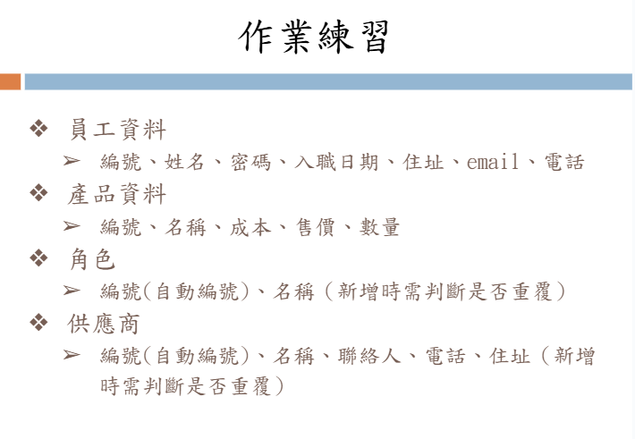

# 練習：員工資料的CRUD

## [v6.2.0] - 2025-05-19
### improved
1. 優化程式架構，移除原有冗於的`history version`，改交由`git`管理，並將最新版本移至根目錄

## [v6.1.0] - 2025-05-05
### added
1. 新增`Models`資料夾，將`SQL`語法從`Controllers`中剝離，以更符合標準MVC語法(Model-View-Controller)

## [v6.0] - 2025-04-28
### improved
1. 優化專案內呼叫方法，棄用原有的`require_once`，使用`Autoload`以符合國際規範
2. 在各專案內都使用`namespace(vendor)`來避免命名重複問題

## [v5.3.1] - 2025-03-31
### improved
1. 優化的前端Axios呼叫的方法，將`baseURL`其統一放至`config.js`以便後續修改時的擴充性及便利性。

## [v5.3.0] - 2025-03-31
### tips
1. 下載下來後記得到`vendor`檔案複製`.env.example`並建立一份自己的`.env`檔案
### improved
1. 重構後端架構，以符合MVC框架規定
2. 將後端入口與其餘程式碼分離，增加資訊安全性

## [v5.2.0] - 2025-03-31
### improved
1. 修正後端資料庫調用方法，新增`.env`檔案以增加資訊安全性

## [v5.1.0] - 2025-03-24
### improved
1. 將原`mysql.php`改為`DB.php`並將其改為靜態static的方法，使程式碼更簡潔且降低系統運行負擔(原有方法效能太差)

## [v5.0.0] - 2025-03-24
### improved
1. 優化class，將重複使用的功能(標準化輸出)歸類為superclass，並從各個子controller呼叫父類別controller

## [v4.2.0] - 2025-03-23
### fixed
1. 修改資料庫結構，新結構如`sql`資料夾內的檔案

### improved
1. 優化程式邏輯，設置邏輯閥檢測【角色】、【供應商】中的[角色名稱]、[供應商地址]重複新增問題
## [v4.1.0] - 2025-03-10
### 部屬方式
1. 先到`sql`資料夾中下載最新版本資料庫檔案並匯入phpmyadmin
2. 將`index.css`檔案刪除或清空內容
3. 依自己需求將各前端顯示的頁面改為自己期望的名稱(因為我的都是跟賽車有關的)
### 更新內容
- 新增auto incurent功能，主key id將會自動新增
- 新增`產品資料`、`角色`、`供應商`三份資料表，對應欄位如下
     1. 產品資料`product`：編號`pid`(自動編號)、名稱`p_name`、成本`cost`、售價`price`、數量`stock`
     2. 角色`role`：編號`rid`(自動編號)、名稱`r_name`(新增時判斷是否重複)
     3. 供應商`supplier`：編號`sid`(自動編號)、名稱`s_name`、聯絡人`contact`、電話`tel`、住址`address`(新增時判斷是否重複)

    
## [v4] - 2025-03-10
- 這是一個練習，需要自行新增名為user的資料表，內有四個varchar欄位，分別為id、passowrd、email、phone
- 這個版本優化了前後端的寫法，是Week4的上課內容
- php class內部method功能若有大量重複部分，可獨立出private function，以便內部呼叫
- 簡單的if-else可以使用另一種寫法 ?expression-true : expression-flase